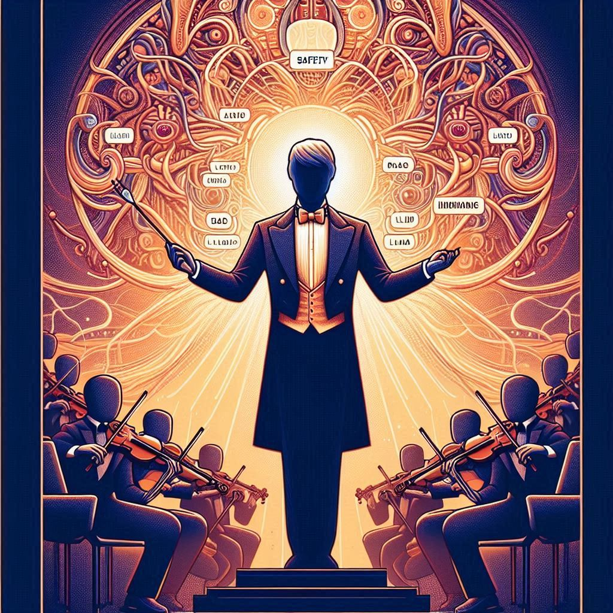

# Building RAG-Enabled Apps and AI Agents with Semantic Kernel and Azure AI

Welcome to our first Azure AI Foundry workshop (signups are closed, but [this is the description on sign-up page](https://www.meetup.com/north-boston-azure-cloud-user-group/events/304611894/)).

_Visualize the AI prompt as a powerful being, a conductor orchestrating the symphony of LLMs.  Create an image where this figure exudes authority and control, while other elements like safety, RAG, SDKs, and programming languages are mere instruments in its grand orchestra. This image should convey the message that the prompt reigns supreme in the realm of LLMs, especially from a developer's standpoint._

These instructions will walk you through the workshop labs.

## Workshop Goals

In this workshop, we provide hands-on experience to help you understand how to AI-enable your applications or create new AI-powered services. The toolbox will be Semantic Kernel (examples and labs in C#) and AI Large Language Models (LLMs) running as services in the Azure AI Foundry. We'll start with the basics of Semantic Kernel, move on to implementing RAG patterns using Azure SQL DB's vector search capabilities, and then have a look at building AI Agents. 

The workshop day is a mix of explanatory lectures intermingled with hands-on labs.

## Learning Objectives

After this workshop, you will be able to:

1. Create a working AI application using Semantic Kernel and backed by Azure AI Foundry services
2. Access 🔍 telemetry data (e.g., token usage stats) available through Semantic Kernel's OpenTelemetry support
3. Make tools available to your Semantic Kernel application by creating function prompts and native functions
4. Apply semantic searching and other modern AI techniques to integrate custom or proprietary data sources backed by Azure SQL DB vector search (🚀 now in public preview)
5. Put AI to work for your organization in a more sophisticated model as an 🤖 AI Agent 

## Assumptions

Attendees are assumed to have explored using or creating chatbots with LLMs and have a sense of what is a prompt, what is prompt engineering, and what are some of the possibilities for using LLMs in applications.

## What is in this repo?

We of course hope that you attend one of our in person workshops and are using this repo to work through the labs with the other attendees. However, we also want you to be able to do the labs at your own pace and revisit when you are building your own projects in the future. We also recognize you may not be able to attend an in person event - so we've included everything you need from the workshop in this repo.

### Presentations

* [Session 1 title here](link to pdf file of presentation)
* [Retrieval Augmented Generation (RAG)](assets/Workshop-RAGIntro.pdf)
* Agentic AI Unlocking the Power of Multi-Agent Systems

### Labs

* Lab 1: [Getting Started with Semantic Kernel](./labs/lab1/readme.md) ([Visual Studio version](./labs/lab1/readme-vs.md))
* Lab 2: [Creating Semantic Kernel Plugins](./labs/lab2/readme.md) ([Visual Studio version](./labs/lab2/readme-vs.md))
* Lab 3: [Using WebRetrieverPlugin to create a RAG application](./labs/lab3/readme.md) ([Visual Studio version](./labs/lab3/readme-vs.md))
* Lab 4: [Creating a RAG application to Search a PDF](./labs/lab4/readme.md) ([Visual Studio version](./labs/lab4/readme-vs.md))
* Lab 5: [Putting it all together](./labs/lab5/readme.md) ([Visual Studio version](./labs/lab5/readme-vs.md))
* Lab 6: [Semantic Kernel Agent Lab](./labs/lab6/README.md)

## Prerequisites

### C#/.NET

Please install this software ahead of the workshop:

1. [VS Code](https://code.visualstudio.com/download) (Windows, Mac, Linux) or [Visual Studio](https://visualstudio.microsoft.com/) (Windows). See [More information on VS Code and VS setup](setup.md)

2. [.NET 8](https://dotnet.microsoft.com/en-us/download) (.NET 9 should work but we have not verified as of 12/1/2024)

3. [SQL Server Management Studio](https://learn.microsoft.com/en-us/sql/ssms/download-sql-server-management-studio-ssms?view=sql-server-ver16) or [Azure Data Studio](https://learn.microsoft.com/en-us/azure-data-studio/download-azure-data-studio)

4. LLM API credentials from Azure AI Foundry (formerly known as Azure AI or Azure OpenAI). The labs use both GPT-4o and text-embedding-ada-002 models. 

> NOTE: For simplicity, we plan to provide credentials for Azure OpenAI services to use during the workshop, after which they will stop working.

5. Database Connection string to a vector search-enabled Azure SQL DB

> NOTE: For simplicity, we plan to provide credentials for an Azure SQL database to use during workshop, after which they will stop working.

📣 You are also welcome to create your own resources and use them in the workshop. Since you are paying for them, you can decide when to decommission associated resources. See [Instructions for creating LLM Connection String](configure-llm.md)

6. You can expect we will recommend you install additional tools and VS Code or Visual Studio extensions, NuGet packages, or code samples as part of the workshop experience.

## Additional Resources

* [Semantic Kernel](https://github.com/microsoft/semantic-kernel)

## Contributors

### Bill Wilder
Add bio and any social contact info

### Jason Haley
I’m an independent Full Stack Solution Architect with a deep focus on Azure and .NET technologies.  I’m currently focused on helping customers integrate Gen AI functionality into their .NET applications.

[LinkedIn](https://www.linkedin.com/in/jason-a-haley/)
[My Blog](https://jasonhaley.com/)
[Email](mailto://info@jasonhaley.com)

### Juan Pablo Garcia Gonzalez
I am an AI Partner Solution Architect working with Microsoft, focusing on AI solutions with our Global Software Company partners group. I have more than 24 years of experience in the tech industry.

[LinkedIn](https://www.linkedin.com/in/jpgarciagonzalez/)

[Twitter](https://twitter.com/liarjo)
