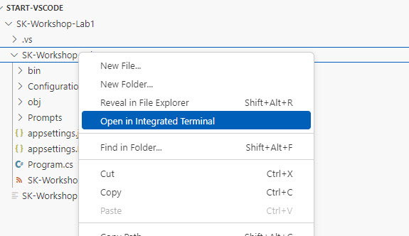
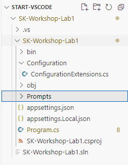
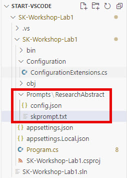

# Lab 1: Getting started with Semantic Kernel

## Learning Objectives

1. Demonstrate how to add Semantic Kernel to an existing application
2. Use Semantic Kernel to chat with the Azure OpenAI LLM
3. Define a prompt template and use it in an application
4. Recognize the need for short term memory and how to add it

## Prerequisites

* Populate the connection string in the appsettings.Local.json file with the values provided in the workshop. If you are doing this after, you will need to use your own settings for either OpenAI or AzureOpenAI. See [how to connect](//TODO) for more information.

## Visual Studio

## Visual Studio Code

### Add Semantic Kernel to the application

1. Open the labs\lab1\src\start\SK-Workshop-Lab1 folder in your VS Code

2. In the file browser, expand the SK-Workshop-Lab1 subfolder and right click on it and select Open in Integrated Terminal



3. Add the package reference to the project by running the following command in the terminal:

```C#
dotnet add package Microsoft.SemanticKernel --version 1.25.0
```

### Configure Semantic Kernel and use Azure OpenAI to chat with the LLM

As we mentioned in the presentation, we want to provide you with some code you'll be able to reuse in your own projects. In this part, we'll use some extension methods created to simplify the configuration of connecting to OpenAI.

1. Open the Program.cs file

2. On line 11, replace the `// TODO` comment with the following code:

```C#
builder.Services.AddKernel().AddChatCompletionService(builder.Configuration.GetConnectionString("OpenAI"));
```

This code takes care of adding a Kernel object to the dependency injection system for us.

This also uses the AddChatCompletionService() extension method we've created in the Configuration/ConfigurationExtensions.cs file. It abstracts the differences between using Azure OpenAI and OpenAI and uses a connection string to capture the configuration settings.

3. On line 15, replace the `// TODO` with the following code used to extract the `IChatCompletionService` from the DI container:

```C#
var chatCompletionService = app.Services.GetRequiredService<IChatCompletionService>();
```

Next we need to create the settings to use for the LLM calls. On line 21, we added a sample prompt that you can change to whatever you would like.

4. Replace line 23 and line 24, with the following lines of code:

```C#
OpenAIPromptExecutionSettings openAIPromptExecutionSettings = new()
{
    Temperature = 0.7f,
    MaxTokens = 250
};
```

We have set the Temperature to 0.7 in order to get a creative response back from the LLM, but feel free play with the value to see how it effects the output.

Last step before we get to see how this works:

5. Replace line 29 with this line, to add the code that uses the chatCompletionService to call the LLM with the prompt and settings configured in the previous steps:

```C#
var step1Result = await chatCompletionService.GetChatMessageContentsAsync(prompt1, openAIPromptExecutionSettings);
```

6. Now run your application and look over the console output.

```C#
dotnet run
```

The output should look something like this:
```text
Prompt tokens: 14. Completion tokens: 222. Total tokens: 236.
STEP 1 OUTPUT --------------------------------------------------------------------------------------

PROMPT:
Who created the first LLM?

RESPONSE:
The concept of large language models (LLMs) evolved over time with contributions from many researchers in the field of natural language processing (NLP) and artificial intelligence (AI). However, one of the significant milestones in the development of LLMs was the introduction of the Transformer architecture by Vaswani et al. in their 2017 paper "Attention is All You Need." This architecture became the foundation for subsequent large language models.

OpenAI's GPT (Generative Pre-trained Transformer) series, starting with GPT-1 released in 2018, is often credited as one of the pioneering implementations of large language models. The team at OpenAI, including researchers such as Alec Radford, Karthik Narasimhan, Tim Salimans, and Ilya Sutskever, played a crucial role in creating and popularizing LLMs with their work on the GPT series.       

Thus, while no single person can be credited with creating the first LLM, the work of the researchers at OpenAI and the introduction of the Transformer model by Vaswani et al. were key developments 
in the field.
```

### Create a Prompt Template and utilize it when calling the LLM

In this section we will save a prompt template to external files - which make it easier to version your prompts as your system changes.

// TODO: find link for information on the skprompt.txt and the config.json files

1. In your file explorer, create a new folder at the project level named **Prompts**



In this example we are going to create a prompt template that will ask the LLM to create a research abstract for a given topic.

2. In the Prompts folder, you just created, create a folder named **ResearchAbstract**, add two new files to that folder named **config.json** and **skprompt.txt**.



3. Open the config.json file and add the following json to it and save:  

```JSON
{
  "schema": 1,
  "description": "Creates an abstract for a provided research topic.",
  "execution_settings": {
    "default": {
      "max_tokens": 500,
      "temperature": 0.7
    }
  },
  "input_variables": [
    {
      "name": "topic",
      "description": "topic for a research abstract",
      "required": true
    }
  ]
}
```

This file contains the settings to use when calling the LLM (ie. `max_tokens` and `temperature`) as well as a description of the purpose and the input variable we will be passing to the template.

4. Open the skprompt.txt file and add the following text to it and save:

```text
<message role="user">Act as an academic research expert. Draft an abstract for a research paper 
for the topic: {{$topic}}. The abstract should succinctly summarize the main objectives, 
methodologies, key findings, and implications of the research. Ensure clarity, coherence, and 
conciseness while adhering to the specific guidelines and conventions of the academic field. 
The abstract should effectively communicate the significance of the research to both experts 
in the field and general readers, encouraging them to delve deeper into the paper.</message>
```

This file contains the prompt we want to send to the LLM. As you can see it is large enough you wouldn't want it hard coded in your C# application, plus now that it is its own file you can track the changes to the prompt using your normal source control system. There is one input variable: `{{$topic}}` which we'll be passing when we use this template.

5. In your Program.cs file, replace the `//TODO:` comments on line 44 and 45 with the following two lines:

```C#
var kernel = app.Services.GetRequiredService<Kernel>();
var prompts = kernel.CreatePluginFromPromptDirectory("Prompts");
```

These two lines get the `Kernel` from the DI system and loads the files under the **Prompts** directory as Semantic Kernel plugins.

On line 46, we set a topic variable to be used with using the template next - feel free to change it to a topic that interests you.

6. Next, replace lines 49 and 50 with these lines of code:

```C#
FunctionResult step2Result = await kernel.InvokeAsync(
        prompts["ResearchAbstract"],
        new() {
            { "topic", topic },
        }
    );
```

This block of code loads the **ResearchAbstract** plugin (saved prompt), using the topic variable and calls the LLM.

6. Now run your application and look for **STEP 2** in the console output.

```C#
dotnet run
```

The output should look something like this:
```text
STEP 2 OUTPUT --------------------------------------------------------------------------------------

RESPONSE:

Title: Unveiling the Potentials and Challenges of Large Language Models: A Comprehensive Analysis

Abstract:
Large language models (LLMs) have revolutionized natural language processing (NLP) with their unprecedented capabilities in understanding and generating human-like text. This research paper aims to 
elucidate the multifaceted potentials and inherent challenges associated with LLMs, particularly focusing on models like GPT-3. Our primary objectives include: (1) assessing the performance of LLMs 
across various NLP tasks, (2) identifying the ethical and practical concerns surrounding their deployment, and (3) exploring strategies to mitigate these challenges. Employing a mixed-methods approach, we conducted extensive quantitative evaluations on benchmark datasets to measure LLM performance and qualitative analyses through expert interviews and literature reviews to understand broader implications.

Key findings reveal that while LLMs exhibit remarkable proficiency in tasks such as translation, summarization, and question-answering, they also pose significant risks related to bias, misinformation, and resource consumption. Furthermore, our analysis highlights the necessity for robust governance frameworks and advanced model interpretability techniques to ensure responsible use. The implications of our research underscore the dual nature of LLMs as both transformative tools and potential vectors for harm, urging stakeholders to adopt a balanced and informed approach in leveraging these models. By presenting a thorough examination of LLMs, this study contributes to the ongoing discourse in the NLP community and provides actionable insights for developers, policymakers, and researchers committed to harnessing the benefits of LLMs while mitigating their risks.
```

## Add short term memory to the LLM chat

Interacting with the LLM using the chat service is stateless, meaning if you ask a followup question to a response it won't know what you are talking about. Next let's see this in action then fix it.

1. Replace lines 68 and 60 with the following code:

```C#
var step3AResult = await chatCompletionService.GetChatMessageContentsAsync(prompt3A, openAIPromptExecutionSettings);
```

In the second section above, you asked for a research abstract to be created. We now ask a followup question and want to have the LLM create a short version of that same abstract.

2. Run your application and look for **STEP 3A** in the console output.

```C#
dotnet run
```

The output should look something like this:
```text
STEP 3A OUTPUT --------------------------------------------------------------------------------------

RESPONSE:
Check out our latest research on improving energy efficiency in smart homes! Discover how innovative technologies can reduce costs and environmental impact. #SmartHomes #EnergyEfficiency #Sustainability
```

The response I got was short but had nothing to do with the research abstract it gave me about large language models.

So let's fix this.

1. Replace the `TODO:` comment on line 76 with the following code:

```C#
var history = new ChatHistory();
history.AddUserMessage(step2Result.RenderedPrompt!);
history.AddAssistantMessage(step2Result.ToString());
```

This code create a `ChatHistory` object and adds the history from the section section - both the user message (our prompt asking for the research abstract) and the assistant message (LLM response) with that abstract.

2. Replace line 82 with the following line, which will add the user message to the history:

```C#
history.AddUserMessage(prompt3B);
```

3. Replace lines 84 and 85 with the following line:

```C#
var step3BResult = await chatCompletionService.GetChatMessageContentsAsync(history, openAIPromptExecutionSettings);
```

This calls the LLM passing the chat history.

4. Run your application and look for **STEP 3B** in the console output.

```C#
dotnet run
```

The output should look something like this:
```text
STEP 3B OUTPUT --------------------------------------------------------------------------------------

RESPONSE:
Exciting breakthroughs in AI! Our latest research dives into large language models (LLMs), uncovering their incredible abilities in text generation, translation, and sentiment analysis. We also highlight challenges like computational demands and bias. These insights pave the way for more efficient and ethical AI development. Curious? Dive into the details with us! #AI #MachineLearning #NLP #TechResearch
```

This time the LLM responded with a short version of the research abstract about large language models.