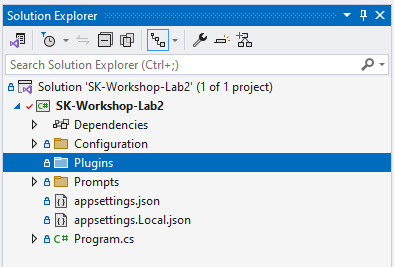
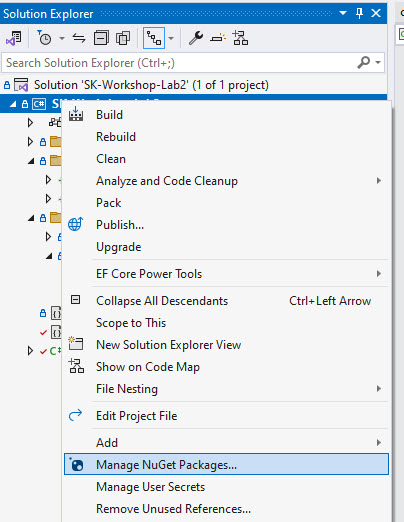
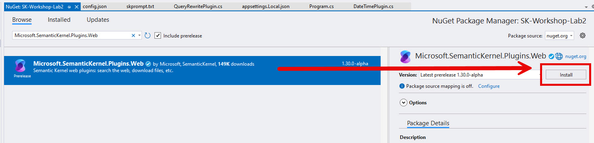
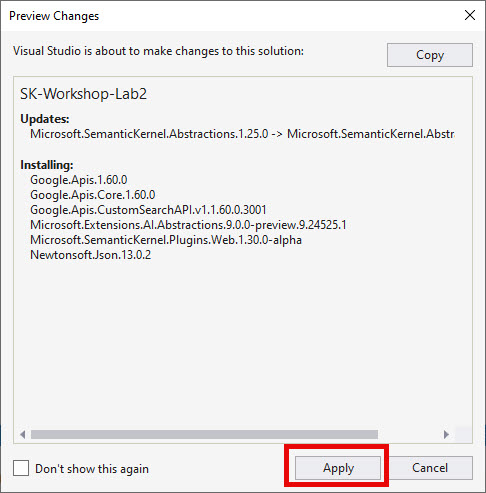
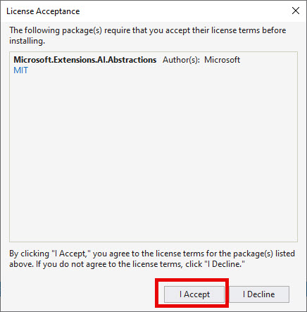
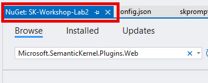

# Lab 2: Creating Semantic Kernel Native Plugins

## Learning Objectives

1. Implement a plugin with native C# code
2. Use a plugin to give an LLM additional information
3. Create a plugin that uses an LLM to rewrite a user query
4. Utilize a Semantic Kernel plugin to perform a web search

## Visual Studio

### Create a native KernelFunction plugin

1. Open the **labs\lab2\src\start\SK-Workshop-Lab2\SK-Workshop-Lab2.sln** in your Visual Studio

2. In the **Solution Explorer**, add a new folder named **Plugins** in the **SK-Workshop-Lab2** project folder



3. Create a **new file** named **DateTimePlugin.cs** 

This is going to be our plugin for performing some native C# code.

4. Copy the following code into the DateTimePlugin.cs file and save:

```C#
using Microsoft.SemanticKernel;
using System.ComponentModel;

namespace Plugins;
public class DateTimePlugin
{
    [KernelFunction, Description("Get the local time zone name")]
    public string TimeZone()
    {
        return TimeZoneInfo.Local.DisplayName;
    }

    [KernelFunction, Description("Get the current date and time")]
    public string DateWithTime()
    {
        return DateTime.Now.ToString("yyyy-MM-dd HH:mm:ss");
    }
}
```

Since LLMs have no idea what today's date and time are or what timezone we are in, we created two **KernelFunction**s that we'll use to provide that information to the LLM.

> NOTE: The plugin provides useful descriptions of the functions in case the LLM needs to decide what functions it should call.

### Use the DateTimePlugin in a prompt

1. In the **Program.cs file**, replace line 28 with the following code in order to load the plugin we just created:

```C#
var plugins = kernel.ImportPluginFromType<DateTimePlugin>("dateTimePlugin");
```

2. Next you'll need to uncomment the `using Plugins;` statement on line 10.

> NOTE: If you are using GitHub copilot, it may have automatically added it for you.

Now let's create a prompt that will require the LLM to know what timezone we are in and what time it currently is.

3. Replace line 30, with this prompt:

```C#
var prompt1 = "What time is it one the west coast of the united states right now? My current timezone {{dateTimePlugin.timeZone}} and current date and time is {{dateTimePlugin.dateWithTime}}";
```

4. Now start your application by hitting **F5** or **Debug -> Start Debugging** and take a look at the console output. Look for **STEP 2A OUTPUT** in the console.

The output should look something like this:
```text
STEP 2A OUTPUT --------------------------------------------------------------------------------------

PROMPT:
What time is it one the west coast of the united states right now? My current timezone {{dateTimePlugin.timeZone}} and current date and time is {{dateTimePlugin.dateWithTime}}

RESPONSE:
I'm sorry, but I can't access real-time data such as the current time. However, you can easily determine the current time on the West Coast of the United States by knowing their time zone. The West Coast is in the Pacific Time Zone (PT). During Standard Time, it is UTC-8, and during Daylight Saving Time, it is UTC-7. You can compare this to your current time zone to find the current time on the West Coast.
```

This shows the prompt did not call the plugin function when we called the LLM - so the result from the LLM indicates it does not know.

Now let's render the prompt so the plugin functions get called.

6: In Program.cs, replace lines 47 and 48 with the following code:

```C#
var promptTemplateFactory = new KernelPromptTemplateFactory();
string userMessage = await promptTemplateFactory.Create(new PromptTemplateConfig(prompt1)).RenderAsync(kernel);
```

This will use the **KernelPromptTemplateFactory** to render the prompt and call the functions in order to populate the values.

7. Now start your application by hitting **F5** or **Debug -> Start Debugging** and take a look at the console output. Look for **STEP 2B OUTPUT** in the console.

The output should look something like this:
```text
STEP 2B OUTPUT --------------------------------------------------------------------------------------
USER MESSAGE: What time is it one the west coast of the united states right now? My current timezone (UTC-05:00) Eastern Time (US &amp; Canada) and current date and time is 2024-11-26 08:30:07
trce: Microsoft.SemanticKernel.Connectors.AzureOpenAI.AzureOpenAIChatCompletionService[0]
      ChatHistory: [{"Role":{"Label":"user"},"Items":[{"$type":"TextContent","Text":"What time is it one the west coast of the united states right now? My current timezone (UTC-05:00) Eastern Time (US \u0026amp; Canada) and current date and time is 2024-11-26 08:30:07"}]}], Settings: {"service_id":null,"model_id":null,"function_choice_behavior":null}
info: Microsoft.SemanticKernel.Connectors.AzureOpenAI.AzureOpenAIChatCompletionService[0]
      Prompt tokens: 60. Completion tokens: 138. Total tokens: 198.

RESPONSE:
Given that your current time is 08:30:07 on November 26, 2024, in the Eastern Time Zone (UTC-5), we need to account for the time difference to determine the time on the West Coast, which is in the Pacific Time Zone (UTC-8).

The Pacific Time Zone is 3 hours behind the Eastern Time Zone. Therefore, to find the time on the West Coast:

08:30:07 (Eastern Time) - 3 hours = 05:30:07 (Pacific Time)

So, the time on the West Coast of the United States would be 05:30:07 on November 26, 2024.
```

If you look at the USER MESSAGE, you'll notice the functions were executed when we rendered the prompt this time, so the LLM now has enough information to answer our question.

### Create a Plugin that uses an LLM to rewrite a user query

Sometimes it is useful to rephrase a user's query or to verify their intent. Let's now create a plugin that can do that.

1. In the Plugins folder, create a new file named **QueryRewritePlugin.cs** and copy the following code into it and save:

```C#
using Microsoft.SemanticKernel;
using System.ComponentModel;
using System.ComponentModel.DataAnnotations;

namespace Plugins;
public class QueryRewritePlugin
{
    
    [KernelFunction, Description("Rewrites the user's question for calling a web search.")]
    public async Task<string> RewriteAsync([Description("User's query"), Required] string question, Kernel kernel)
    {
        var prompts = kernel.CreatePluginFromPromptDirectory("Prompts");
        
        var result = await kernel.InvokeAsync(
            prompts["RewriteQuery"],
            new() {
                { "question", question },
            }
        );

        return result.ToString();
    }
}
```

This plugin function uses the **RewriteQuery** prompt in the **Prompts** folder (shown below) to have the LLM rephrase any given question.

```xml
<message role="system">
Provide a better search query for a web search engine to answer the given question.
</message>
<message role="user">{{$question}}</message>
```

2. In the **Program.cs file**, replace line 66 with the following code (in order to load the plugin):

```C#
var rewriter = kernel.ImportPluginFromType<QueryRewritePlugin>();
```

3. Now, replace line 70 with the following:

```C#
var step3Result = await kernel.InvokeAsync(rewriter["Rewrite"], 
    new()
    {
        { "question", prompt2 }
    });
```

You've already seen code to call an LLM using a prompt function, calling the native plugin is the same syntax.

4. Now start your application by hitting **F5** or **Debug -> Start Debugging** and take a look at the console output. Look for **STEP 3 OUTPUT** in the console.

The output should look something like this:
```text
STEP 3 OUTPUT --------------------------------------------------------------------------------------

PROMPT:
What are some things to do in Boston this weekend?
Rewritten query: "Events and activities in Boston November 30 - December 1, 2024"
```

### Use the WebSearchEnginePlugin from the Microsoft.SemanticKernel.Plugins.Web library

In this section, you will see how powerful adding web searching is to an LLM chat and how easy Semantic Kernel makes it.

1. In the Solution Explorer, right click on the **SK-Workshop-Lab2 project -> Manage NuGet Packages...**



2. Make sure you are on the **Browse** tab, type `Microsoft.SemanticKernel.Plugins.Web` in the search box and check the **include prerelease** checkbox.

3. Select the top item (version may be newer than this image) and click **Install**:



4. Click **Apply** on the Preview Changes dialog



5. Click **I Accept** on the License Acceptance dialog



You can now close the NuGet tab in Visual Studio



6. In the **Progam.cs file**, uncomment lines 8 and 9 to import the namespaces we'll need to use.

7. Replace line 86 with the following code:

```C#
kernel.ImportPluginFromObject(
    new WebSearchEnginePlugin(new BingConnector(pluginOptions.BingApiKey)));
```

This code will add the WebSearchEnginePlugin and configure it to use Bing for searching. A Bing key is included in the appsettings.Local.json for the day of the workshop.

8. Now start your application by hitting **F5** or **Debug -> Start Debugging** and take a look at the console output. Look for **STEP 4 OUTPUT** in the console.

The output should look something like this:
```text
STEP 4 OUTPUT --------------------------------------------------------------------------------------

PROMPT:
Events and activities in Boston November 30 - December 1, 2024

RESPONSE:
Here are some events and activities happening in Boston from November 30 to December 1, 2024:

1. **Franklin Park Zoo Winter Activities & Exhibits**: Enjoy a variety of seasonal activities and exhibits at the Franklin Park Zoo.

2. **Arts & Crafts - Draw! Fall Program**: Participate in a 10-week drop-in arts and crafts course.

3. **Annual Holiday Ship Lighting in Martin's Park**: Join the festive event where Santa arrives by boat as part of the holiday celebrations.

4. **SoWa Winter Festival**: Explore over 150 vendors offering artisanal chocolates, hand-pressed olive oil, and more. The festival runs from November 29 through December 22, 2024.

5. **The Nutcracker by Boston Ballet**: Experience a classic holiday performance by the Boston Ballet.

These events provide a mix of cultural, artistic, and festive activities to enjoy in Boston during that time.
```

The last request used both the DateTimePlugin we created earlier and the WebSearchEnginePlugin to provide a nice user experience.

