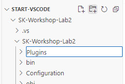
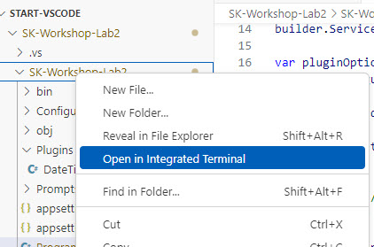

# Lab 2: Creating Semantic Kernel Plugins

## Learning Objectives

1. Implement a plugin with native C# code
2. Use a plugin to give an LLM additional information
3. Create a plugin that uses an LLM to rewrite a user query
4. Utilize a Semantic Kernel plugin to perform a web search

## Visual Studio

### Create a native KernelFunction plugin

1. Open the labs\lab2\src\start\SK-Workshop-Lab2 folder in your VS Code

2. In the file browser, add a new folder named **Plugins** under the **SK-Workshop-Lab2** folder



3. Create a new file named DateTimePlugin.cs. This is going to be our plugin for performing some native C# code.

4. Copy the following code into the DateTimePlugin.cs file and save:

```C#
using Microsoft.SemanticKernel;
using System.ComponentModel;

namespace Plugins;
public class DateTimePlugin
{
    [KernelFunction, Description("Get the local time zone name")]
    public string TimeZone()
    {
        return TimeZoneInfo.Local.DisplayName;
    }

    [KernelFunction, Description("Get the current date and time")]
    public string DateWithTime()
    {
        return DateTime.Now.ToString("yyyy-MM-dd HH:mm:ss");
    }
}
```

Since LLMs have no idea what today's date and time are or what timezone we are in, we created two **KernelFunction**s that we'll be able to use to provide that information to the LLM.

The plugin provides useful descriptions of the functions in case the LLM needs to decide what functions it should call.

### Use the DateTimePlugin in a prompt

1. In the Program.cs file, replace line 28 with the following code in order to load the plugin we just created:

```C#
var plugins = kernel.ImportPluginFromType<DateTimePlugin>("dateTimePlugin");
```

2. Next you'll need to uncomment the `using Plugins;` statement on line 10.

Now let's create a prompt that will require the LLM to know what timezone we are in and what time it currently is.

3. Replace line 30, with this prompt:

```C#
var prompt1 = "What time is it one the west coast of the united states right now? My current timezone {{dateTimePlugin.timeZone}} and current date and time is {{dateTimePlugin.dateWithTime}}";
```

4. In the file browser, expand the SK-Workshop-Lab2 subfolder and right click on it and select Open in Integrated Terminal



5. In the terminal, run your application and look for **STEP 2A OUTPUT** in the console output.

```C#
dotnet run
```

The output should look something like this:
```text
STEP 2A OUTPUT --------------------------------------------------------------------------------------

PROMPT:
What time is it one the west coast of the united states right now? My current timezone {{dateTimePlugin.timeZone}} and current date and time is {{dateTimePlugin.dateWithTime}}

RESPONSE:
I'm sorry, but I can't access real-time data such as the current time. However, you can easily determine the current time on the West Coast of the United States by knowing their time zone. The West Coast is in the Pacific Time Zone (PT). During Standard Time, it is UTC-8, and during Daylight Saving Time, it is UTC-7. You can compare this to your current time zone to find the current time on the West Coast.
```

This shows the PROMPT did not execute the function when we called the LLM - so the result from the LLM indicates it does not know.

Now let's render the prompt so the plugin functions get called.

6: Replace lines 47 and 48 with the following code:

```C#
var promptTemplateFactory = new KernelPromptTemplateFactory();
string userMessage = await promptTemplateFactory.Create(new PromptTemplateConfig(prompt1)).RenderAsync(kernel);
```

This will use the **KernelPromptTemplateFactory** to render the prompt and call the functions in order to populate the values.

7. In the terminal, run your application again and look for **STEP 2B OUTPUT** in the console output.

```C#
dotnet run
```

The output should look something like this:
```text
STEP 2B OUTPUT --------------------------------------------------------------------------------------
USER MESSAGE: What time is it one the west coast of the united states right now? My current timezone (UTC-05:00) Eastern Time (US &amp; Canada) and current date and time is 2024-11-01 15:55:29
info: Microsoft.SemanticKernel.Connectors.AzureOpenAI.AzureOpenAIChatCompletionService[0]
      Prompt tokens: 60. Completion tokens: 127. Total tokens: 187.

RESPONSE:
The West Coast of the United States is in the Pacific Time Zone (PT), which is UTC-08:00. Since your current time is 15:55:29 (3:55:29 PM) in the Eastern Time Zone (ET), you need to subtract 3 hours to convert to Pacific Time 
(PT).

15:55:29 - 3 hours = 12:55:29 (12:55:29 PM)

So, the current time on the West Coast (Pacific Time) is 12:55:29 (12:55:29 PM) on November 1, 2024.
```

If you look at the USER MESSAGE, you'll notice the functions were executed when we rendered the prompt, so the LLM now has enough information to answer our question.

### Create a Plugin that uses an LLM to Rewrite a user query

Sometimes it is useful to rephrase a user's query or to verify their intent. Let's now create a plugin that can do that.

1. In the Plugins folder, create a new file named **QueryRewritePlugin.cs** and copy the following code into it:

```C#
using Microsoft.SemanticKernel;
using System.ComponentModel;
using System.ComponentModel.DataAnnotations;

namespace Plugins;
public class QueryRewritePlugin
{
    
    [KernelFunction, Description("Rewrites the user's question for calling a web search.")]
    public async Task<string> RewriteAsync([Description("User's query"), Required] string question, Kernel kernel)
    {
        var prompts = kernel.CreatePluginFromPromptDirectory("Prompts");
        
        var result = await kernel.InvokeAsync(
            prompts["RewriteQuery"],
            new() {
                { "question", question },
            }
        );

        return result.ToString();
    }
}
```

This plugin function uses the **RewriteQuery** prompt in the **Prompts** folder (shown below) to have the LLM rephrase any given question.

```xml
<message role="system">
Provide a better search query for a web search engine to answer the given question.
</message>
<message role="user">{{$question}}</message>
```

2. In the Program.cs file, replace line 66 with the following code (in order to load the plugin):

```C#
var rewriter = kernel.ImportPluginFromType<QueryRewritePlugin>();
```

3. Now, replace line 70 with the following:

```C#
var step3Result = await kernel.InvokeAsync(rewriter["Rewrite"], 
    new()
    {
        { "question", prompt2 }
    });
```

You've already seen code to call an LLM with prompt templates, calling the native plugin is the same syntax.

4. In the terminal, run your application again and look for **STEP 3 OUTPUT** in the console output.

```C#
dotnet run
```

The output should look something like this:
```text
STEP 3 OUTPUT --------------------------------------------------------------------------------------

PROMPT:
What are some popular Boston landmarks I should see?
Rewritten query: Popular landmarks to visit in Boston
info: Microsoft.SemanticKernel.Connectors.AzureOpenAI.AzureOpenAIChatCompletionService[0]
      Prompt tokens: 13. Completion tokens: 250. Total tokens: 263.
```

### Use the WebSearchEnginePlugin from the Microsoft.SemanticKernel.Plugins.Web library

In this section, you will see how powerful adding web searching is to an LLM chat and how easy Semantic Kernel makes it.

1. Add the package reference to the project by running the following command in the terminal:

```PowerShell
dotnet add package Microsoft.SemanticKernel.Plugins.Web --version 1.25.0-alpha
```

2. Uncomment lines 8 and 9 to import the namespaces we'll need to use.

3. Replace line 86 with the following code:

```C#
kernel.ImportPluginFromObject(
    new WebSearchEnginePlugin(new BingConnector(pluginOptions.BingApiKey)));
```

This code will add the WebSearchEnginePlugin and configure it to use Bing for searching. A Bing key is included in the appsettings.Local.json for the day of the workshop.

4. In the terminal, run your application again and look for **STEP 4 OUTPUT** in the console output.

```C#
dotnet run
```

The output should look something like this:
```text
STEP 4 OUTPUT --------------------------------------------------------------------------------------

PROMPT:
Events and activities in Boston this weekend

RESPONSE:
Here are some events and activities happening in Boston this weekend:

1. **Dia de Muertos Festival at ICA Watershed** - Celebrate the Day of the Dead with cultural festivities.
2. **Boston Halloween Parties and Scary Movies** - Various locations around Boston.
3. **Concerts and Theatre Shows** - Check out the latest performances in Boston's vibrant arts scene.
4. **Museum Exhibits and Family-Friendly Activities** - Various museums around the city.
5. **Fall Festivals and Markets** - Experience the fall season with local festivals and markets.
6. **Weekend Beer Garden** - Enjoy a drink at Charlestown’s Hood Park.
7. **Asian Cuisine Cooking Competition** - Hosted by Cozymeal™.

For a comprehensive list, you can visit local event calendars like [The Boston Calendar](https://www.thebostoncalendar.com/) or [ArtsBoston](https://calendar.artsboston.org/).
```

The last request used both the DateTimePlugin we created earlier and the WebSearchEnginePlugin to provide a nice user experience.

