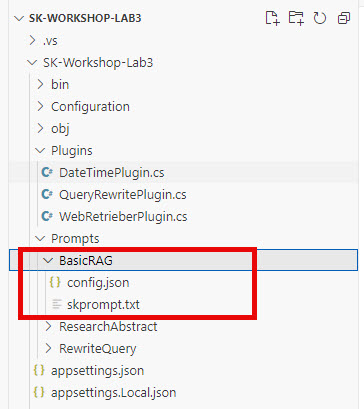

# Lab 3: Using WebRetrieverPlugin to create a RAG application

## Learning Objectives

1. Build a plugin to combine the rewriting of a user's query and a web search
2. Write a prompt to perform a basic RAG pattern call to an LLM
3. Implement a simple chatbot loop
4. Demonstrate the usefulness of a RAG implementation

## Visual Studio Code

### Create a plugin that uses the WebSearchEnginePlugin

1. Open the labs\lab3\src\start\SK-Workshop-Lab3 folder in VS Code

2. In the **Plugins** folder create a file named **WebRetrieverPlugin.cs**

3. Paste the following code into the file and save it:

```C#
using Configuration;
using Microsoft.Extensions.Options;
using Microsoft.SemanticKernel;
using Microsoft.SemanticKernel.Plugins.Web;
using Microsoft.SemanticKernel.Plugins.Web.Bing;
using System.ComponentModel;
using System.ComponentModel.DataAnnotations;

namespace Plugins;

public class WebRetrieverPlugin(IOptions<PluginOptions> pluginOptions)
{
    
    [KernelFunction, Description("Searches the web for answering user questions.")]
    public async Task<string> RetrieveAsync([Description("User's query"), Required] string question, Kernel kernel)
    {
        var rewriter = kernel.Plugins["QueryRewritePlugin"];
        
        var searchQuery = await kernel.InvokeAsync(rewriter["Rewrite"],
            new()
            {
                { "question", question }
            });

        var searchEngine = new WebSearchEnginePlugin(new BingConnector(pluginOptions.Value.BingApiKey));
        var searchResults = await searchEngine.SearchAsync(searchQuery.ToString());
        
        var rag = kernel.Plugins["Prompts"];

        var llmResult = await kernel.InvokeAsync(rag["BasicRAG"],
            new() {
                { "question", question },
                { "context", searchResults }
            }
        );

        return llmResult.ToString();
    }

}
```

This plugin creates a new plugin with a KernelFunction **Retrieve** that uses the **QueryRewritePlugin** we used in lab 2. Before continuing, let's make a small modification to it to add the current date and time information to the user's question.

4. Open the \Prompts\RewriteQuery\skprompt.txt file and replace line 2 with this text:

```text
Provide a better search query for a web search engine to answer the given question. Take into consideration that the current date and time is {{DateTimePlugin.DateWithTime}}
```

This will  use our **DateTimePlugin** to ensure the search query passed to the **WebSearchEnginePlugin** has information about today's date and time.

Back to the WebRetrieverPlugin Retrieve method. Once we've had the user's question rephrased to a better search query we manually use the WebSearchEnginePlugin and call its `SearchAsync` method to get a string array of search results.

Next we want to use those results to perform RAG, so we need to create the **BasicRAG** prompt function next.

### Implement a Basic RAG prompt to use the web search results

1. In the **Prompts** folder, create a new folder named **BasicRAG** and add two new files to that folder named **config.json** and **skprompt.txt**.



2. Open the **config.json** file and add the following json to it and save:

```json
{
  "schema": 1,
  "description": "Basic retrieval augumented generation prompt",
  "execution_settings": {
    "default": {
      "max_tokens": 500,
      "temperature": 0.2
    }
  },
  "input_variables": [
    {
      "name": "question",
      "description": "User's question",
      "required": true
    },
    {
      "name": "context",
      "description": "Data provided to the LLM to answer the user's question",
      "required": true
    }
  ]
}
```

This file contains the settings to use when calling the LLM (ie. max_tokens and temperature) as well as a description of the purpose and the input variables we will be passing to the template.

3. Open the **skprompt.txt** file and add the following text to it and save:

```text
<message role="system">
You are a friendly assistant that helps users find answers to their questions. 
Be brief in your answers.

Answer ONLY with the facts listed in the list of sources below. 
If there isn't enough information below, say you don't know. 
Do not generate answers that don't use the sources below.

# Sources:
{{$context}}
</message>
<message role="user">{{$question}}</message>
```

This is a very basic RAG prompt that provides general system instructions, the context will be filled with the web search results and then the user's question will be added.

### Add a chatbot loop to interact with the LLM

In the previous labs we were just using Console Write lines to view our output, in this section we'll create a loop so the interaction is more like a chatbot.

1. In the **Program.cs** file, replace line 23 with the following line in order to import our new plugin:

```C#
kernel.ImportPluginFromType<WebRetrieverPlugin>();
```

2. Next replace line 32 with the following block of code:

```C#
var responseTokens = new StringBuilder();
ChatHistory chatHistory = [];
while (true)
{
    Console.Write("\nQuestion: ");

    var question = Console.ReadLine();
    if (string.IsNullOrWhiteSpace(question))
    {
        break;
    }

    chatHistory.AddUserMessage(question);
    responseTokens.Clear();
    await foreach (var update in chatCompletionService.GetStreamingChatMessageContentsAsync(chatHistory, openAIPromptExecutionSettings, kernel))
    {
        Console.Write(update);
        responseTokens.Append(update);
    }
    
    chatHistory.AddAssistantMessage(responseTokens.ToString());
    Console.WriteLine();
}
```

This block of code uses **ChatHistory** to add a sort of short term memory to the chat experience. This allows you to refer to previous responses in the chat session (as you'll see in the next section).

The loop keeps going until the user hits enter.

Notice how the ChatHistory is updated to keep track of the different messages (User and Assistant)

```C#
ChatHistory chatHistory = [];
while (true)
{
    ...  
    chatHistory.AddUserMessage(question);
    
    await foreach (var token in chatCompletionService.GetStreamingChatMessageContentsAsync(chatHistory, openAIPromptExecutionSettings, kernel))
    {
        ...
        responseTokens.Append(token);
    }
    ...
    chatHistory.AddAssistantMessage(responseTokens.ToString());
}
```

The `responseTokens` StringBuilder is used to capture the tokens as they are returned from the `GetStreamingChatMessageContentsAsync` method, then added to the chat history once the response is complete.

### Test the chatbot

Finally, we can test it!

1. In the file browser, find the SK-Workshop-Lab3 subfolder and right click on it and select **Open in Integrated Terminal**

2. In the terminal, run your application.

```C#
dotnet run
```

3. When the `Question:` prompt shows, enter a question that requires knowledge of today's date, like: **What is going on in Indianapolis today?**

The output should look something like this:
```text
Question: What is going on in Indianapolis today?
Today in Indianapolis, Taylor Swift will be performing her final U.S. concert of The Eras Tour at Lucas Oil Stadium. The city is also hosting various Swift-themed celebrations, including pop-up performances, pre-parties, interactive art stations, and glam makeovers.
```

4. Next, ask a followup question that assumes knowledge of the previous interaction, like: **Are there any tickets left to the Taylor Swift concert?**

The output should look something like this:

```text
Question: Are there any tickets left to the Taylor Swift concert?
Yes, there are still tickets available for Taylor Swift's concert in Indianapolis on November 3, 2024. You can find tickets on Vivid Seats, SeatGeek, and Ticketmaster. The concert will take place at Lucas Oil Stadium and will start at 7:00 PM.
```

5. You can continue to carry on the conversation. For example, I asked **How much do they cost?**

The output was:

```text
Question: How much do they cost?
The cheapest tickets for Taylor Swift's concert in Indianapolis on November 3, 2024, start at $2,145 on Vivid Seats.
```

