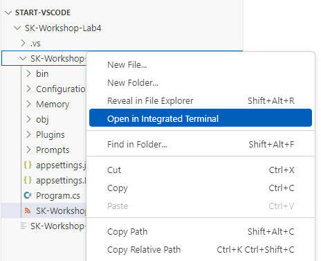
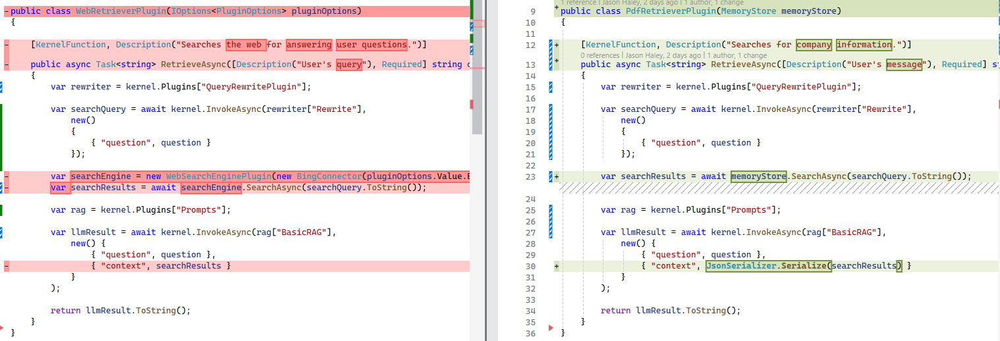

# Lab 4: Creating a RAG application to Search a PDF

## Learning Objectives

1. Configure a vector store to use with the application
2. Read, chunk and ingest a pdf file
3. Implement logic to perform a similarity search on the vector store
4. Create a plugin to perform RAG using the memory store

### Visual Studio

In this lab you will use a [Semantic Kernel Vector Store Connector](https://learn.microsoft.com/en-us/semantic-kernel/concepts/vector-store-connectors/?pivots=programming-language-csharp) to provide semantic searching capability.

1. Open the labs\lab4\src\start\SK-Workshop-Lab4 folder in VS Code

2. In the file browser, expand the SK-Workshop-Lab4 subfolder and right click on it and select Open in Integrated Terminal



In this lab we are going to use the [Microsoft.SemanticKernel.Connectors.SqlServer](https://github.com/microsoft/semantic-kernel/tree/main/dotnet/src/Connectors/Connectors.Memory.SqlServer) connector to store vector embeddings in an Azure SQL Database. In order to do this, we need to install the package first.

3. Add the package reference to the project by running the following command in the terminal:

```C#
dotnet add package Microsoft.SemanticKernel.Connectors.SqlServer --version 1.25.0-alpha
```

4. In the **Programs.cs** file, replace line 20 with the following code:

```C#
var semanticTextMemory = new MemoryBuilder()
    .WithSqlServerMemoryStore(builder.Configuration.GetConnectionString("SqlAzureDB")!)
    .WithTextEmbeddingGeneration(builder.Configuration.GetConnectionString("OpenAI")!)
    .Build();
```

The **MemoryBuilder** will build a **ISemanticTextMemory** which is basically a wrapper the provides the ability to interact with an underlying vector store and a text embedding service. The **WithSqlServerMemoryStore** extension method is provided by the package you just installed. The **WithTextEmbeddingGeneration** extension method is in the Configuration/ConfigurationExtensions.cs in the project. It follows the same pattern we've been using with the **AddChatCompletionService** extension method in order to easily switch between using OpenAI or Azure OpenAI.

Next we need to populate the vector store.

### Populate the Vector Store with embeddings from a PDF file

In order to keep things clean in this example, we've put the majority of the memory store logic in the **MemoryStore** class. The **MemoryExtensions.cs** file includes a couple of extension methods used to simplify the memory store code.

1. Open the Memory\MemoryStore.cs file. Replace line 13 with a TABLE_NAME value that will be unique for the day - such as your initials and memory. For example:

```C#
private const string TABLE_NAME = "jh-memory";
```

This is so you will be able to see the data ingested, otherwise it will be using a table that is already filled.

2. Locate the **PopulateAsync** method on line 24 and paste the following code in that method:

```C#
var chunkCount = 0;
var tokenizer = TiktokenTokenizer.CreateForModel("gpt-4o");

foreach (var file in Directory.GetFiles(assetsDir, "*.pdf"))
{
    Console.WriteLine($"Generating chunks for {file}...");
                
    var docId = Path.GetFileNameWithoutExtension(file);

    // See if file already ingested
    if (await semanticTextMemory.TableExistsAsync(TABLE_NAME) 
        && await semanticTextMemory.RecordExistsAsync(TABLE_NAME, GenerateKey(docId, 1, 0)))
    {
        Console.WriteLine($"Document {docId} already exists.");
        continue;
    }
    
    using var pdf = PdfDocument.Open(file);
    foreach (var page in pdf.GetPages())
    {
        var pageText = GetPageText(page);
        var paragraphs = TextChunker.SplitPlainTextParagraphs([pageText], 500, 100, null, text => tokenizer.CountTokens(text));
        
        for (int i = 0; i < paragraphs.Count; i++)
        {
            var paragraph = paragraphs[i];

            var textToEmbed = paragraph;
            var title = $"Document {docId}, Page {page.Number}, Chunk {i}";

            await semanticTextMemory.SaveInformationAsync(TABLE_NAME, textToEmbed, GenerateKey(docId, page.Number, i), title);
            chunkCount++;

            Console.WriteLine($"Saved {title}...");
        }
    }
}

if (chunkCount > 0)
{
    Console.WriteLine($"Generated {chunkCount}.");
}
```

There is a lot going on in this one method, let's look at the important stuff.

The line 27: `var tokenizer = TiktokenTokenizer.CreateForModel("gpt-4o");` uses **TiktokenTokenizer** to create a "gpt-4o" compatible tokenizer so we can split on tokens and not arbitrary characters.

The loop starting on line 29: `foreach (var file in Directory.GetFiles(assetsDir, "*.pdf"))` starts looping though any pdf files found in the assets directory.

Lines 36 and 37 use the extension methods in the MemoryExtensions.cs file to determine if the file has already been saved in the vector store to prevent duplicates when the sample is run multiple times.

Line 43: `using var pdf = PdfDocument.Open(file);` uses the UglyToad.PdfPig library to open the PDF file.

Line 44: `foreach (var page in pdf.GetPages())` starts the loop parsing each page in the PDF file into a page object.

Line 45: `var pageText = GetPageText(page);` cleans the text up a bit

Line 46: `var paragraphs = TextChunker.SplitPlainTextParagraphs([pageText], 500, 100, null, text => tokenizer.CountTokens(text));` takes the pageText and split it into a max of 500 tokens with a 100 token overlap.

Line 45 starts the loop through all the paragraphs returned from the **TextChunker**.

Line 56: `await semanticTextMemory.SaveInformationAsync(TABLE_NAME, textToEmbed, GenerateKey(docId, page.Number, i), title);` uses the underlying memory storage connector to get the embeddings from Azure OpenAI for the **textToEmbed** and saves to the Azure SQL Database table.

Let's now see it in action.

3. In the **Program.cs** file, replace line 46 with the following lines:

```C#
var assetsDir = PathUtils.FindAncestorDirectory("assets");
await memoryStore.PopulateAsync(assetsDir);
```

This will find the assets folder up a few levels in the source tree and start the memory store population.

4. Now run your application and look over the console output. This will take a minute or two.

```C#
dotnet run
```

The output should look something like this:
```text
Generating chunks for D:\...\rag-vector-agent-semantic-kernel\labs\lab4\assets\MSFT_FY25Q1_10Q.pdf...
Saved Document MSFT_FY25Q1_10Q, Page 1, Chunk 0...
Saved Document MSFT_FY25Q1_10Q, Page 1, Chunk 1...
Saved Document MSFT_FY25Q1_10Q, Page 2, Chunk 0...
....
Saved Document MSFT_FY25Q1_10Q, Page 65, Chunk 0...
Saved Document MSFT_FY25Q1_10Q, Page 66, Chunk 0...
Generated 152.

Question:
```

5. Hit enter a couple of times in the terminal in order to have the chatbot loop return

The PDF file is now in the database.

// TODO: Add step to connect to Azure SQL db and look at the table??

### Add logic to **MemoryStore** to preform a semantic search

1. In the Memory\MemoryStore.cs file. Replace line 19 with the following code:

```C#
var searchItems = semanticTextMemory.SearchAsync(TABLE_NAME, query, 3);
await foreach (var item in searchItems)
{
    results.Add(item.Metadata.Text);
}
```

Line 19 `var searchItems = semanticTextMemory.SearchAsync(TABLE_NAME, query, 3);` performs the semantic search using the underlying connector. The last parameter is the number of results to return, in this case we are only returning 3.

The loop on line 20 iterates all the results and builds a list of the item text to return to the calling logic.

### Create a plugin that perform RAG with the vector store

1. In the **Plugins** folder, create a file named **PdfRetrieverPlugin.cs**

2. Paste the following code into the file and save it:

```C#
using Microsoft.SemanticKernel;
using System.ComponentModel;
using System.ComponentModel.DataAnnotations;
using System.Text.Json;

namespace Plugins;

public class PdfRetrieverPlugin(MemoryStore memoryStore)
{
    
    [KernelFunction, Description("Searches for company information.")]
    public async Task<string> RetrieveAsync([Description("User's message"), Required] string question, Kernel kernel)
    {
        var rewriter = kernel.Plugins["QueryRewritePlugin"];

        var searchQuery = await kernel.InvokeAsync(rewriter["Rewrite"],
            new()
            {
                { "question", question }
            });

        var searchResults = await memoryStore.SearchAsync(searchQuery.ToString());

        var rag = kernel.Plugins["Prompts"];

        var llmResult = await kernel.InvokeAsync(rag["BasicRAG"],
            new() {
                { "question", question },
                { "context", JsonSerializer.Serialize(searchResults) }
            }
        );

        return llmResult.ToString();
    }
}
```

If you compare this to the WebRetrieverPlugin we created in the last lab (below), you'll notice there are only a three of changes (other than their descriptions):



* MemoryStore is being passed in the constructor
* The memoryStore SearchAsync is used instead of the WebSearchEngingPlugin's SearchAsync
* Manually serialize the searchResults to a JSON array string

3. In **Program.cs**, replace line 37 with the following line to import the new plugin:

```C#
kernel.ImportPluginFromType<PdfRetrieverPlugin>();
```

4. Run your application and start to interact with Microsoft's latest S1 filing PDF file.

```C#
dotnet run
```

5. Some example questions to ask:

* What was Microsoft's income in the last quarter?
* What was Microsoft's Cloud division's income?
* What were some industry trends mentioned?
* Was OpenAI mentioned in the S1?
* What did it say about OpenAI?

The output should look something like this:
```text
Document MSFT_FY25Q1_10Q already exists.

Question: What was Microsoft's income in the last quarter?
Microsoft's net income for the quarter ended September 30, 2024, was $24,667 million.

Question: What was Microsoft's Cloud division's income?
The operating income for Microsoft's Intelligent Cloud division in the last quarter was $10.5 billion.

Question: What were some industry trends mentioned?
The industry trends mentioned in Microsoft's last quarter report include:

- The industry is dynamic and highly competitive, with frequent changes in both technologies and business models.
- Each industry shift is an opportunity to conceive new products, new technologies, or new ideas that can further transform the industry and Microsoft's business.
- Microsoft engages in a broad range of research and development activities to identify and address the changing demands of customers and users, industry trends, and competitive forces.

Question: Was OpenAI mentioned in the S1?
Yes, OpenAI was mentioned in Microsoft's S1.

Question: What did it say about OpenAI?
Microsoft's S1 mentioned that AI may be developed by Microsoft or others, including their strategic partner, OpenAI.

Question:
```