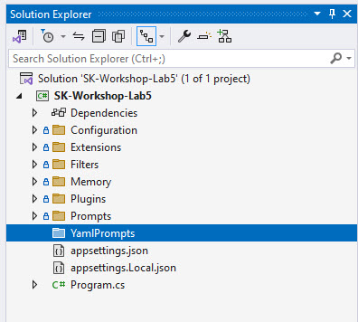
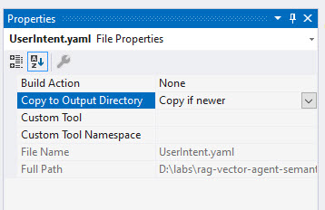

# Lab 5: Putting it all together

## Learning Objectives

1. Use filters to add logging and understand the call flows
2. Have the LLM determine which plugin functions to call
3. Create a plugin to determine the user's intent
4. Dynamically control the functions available to the LLM depending on the user's intent

### Visual Studio

In this lab we extend the chatbot to determine if a user's question should be answered by using the web search (`WebRetrieverPlugin` from lab 3) or the semantic search (`PdfRetrieverPlugin` from lab 4). 

### Add Filters and Logging to Understand the Logic Flow
First we are going use [Filters](https://learn.microsoft.com/en-us/semantic-kernel/concepts/enterprise-readiness/filters?pivots=programming-language-csharp) to understand the logic flow and add some logging.

1. Open the **labs\lab5\src\start\SK-Workshop-Lab5\SK-Workshop-Lab5.sln** solution in Visual Studio

2. In the **Program.cs** file, replace line 22 with the following lines:

```C#
builder.Services.AddSingleton<IFunctionInvocationFilter, FunctionInvocationLoggingFilter>();
builder.Services.AddSingleton<IPromptRenderFilter, PromptRenderLoggingFilter>();
builder.Services.AddSingleton<IAutoFunctionInvocationFilter, AutoFunctionInvocationLoggingFilter>();
```

These lines wire up the filters to the dependency container for Semantic Kernel to load at execution time.

All three of these filters were taken form the [Semantic Kernel Samples](https://github.com/microsoft/semantic-kernel/blob/main/dotnet/samples/Concepts/Filtering/TelemetryWithFilters.cs) and modified slightly.

#### AutoFunctionInvocationLoggingFilter
This filter implements the `IAutoFunctionInvocationFilter` interface and is executed during an automatic function calling process - driven by the LLM. Use cases when you may use this filter include: early termination of auto function calling, and tracking function calling. 

#### FunctionInvocationLoggingFilter
This filter implements the `IFunctionInvocationFilter` interface and is called when a Semantic Kernel function is invoked. Uses cases for this filter include: handling exceptions during function execution, modifying a function result, retries on failures.

#### PromptRenderLoggingFilter
This filter implements the `IPromptRenderFilter` interface and is triggered when a prompt is being rendered. Use cases for this filter include: modifying the prompt before sending to LLM, calling out to [Prompt Shields](https://learn.microsoft.com/en-us/azure/ai-services/content-safety/concepts/jailbreak-detection) to analyze the prompt, caching of prompts, removal of PII, etc.

3. Now start your application by hitting **F5** or **Debug -> Start Debugging** and take a look at the console output.

5. First ask a question that won't call the `PdfRetrieverPlugin` like: **When does Microsoft's fiscal year start?**

The output should look something like this: 
```console
Question: When does Microsoft's fiscal yeaer start?
Microsoft's fiscal year starts on July 1st and ends on June 30th of the following year.
```

Since none of the filters were called, that means the LLM answered the question itself and did not call back into our functions.

Next, let's ask a question that will cause the `PdfRetrieverPlugin` to be called like: **What was Microsoft's income last quarter?**

The output will now have a lot of logging in it:

```console
Question: What was Microsoft's income last quarter?
warn: AutoFunctionInvocationLoggingFilter[0]
      ChatHistory: [{"Role":{"Label":"user"},"Items":[{"$type":"TextContent","Text":"When does Microsoft\u0027s fiscal yeaer start?"}]},{"Role":{"Label":"assistant"},"Items":[{"$type":"TextContent","Text":"Microsoft\u0027s fiscal year starts on July 1st and ends on June 30th of the following year."}]},{"Role":{"Label":"user"},"Items":[{"$type":"TextContent","Text":"What was Microsoft\u0027s income last quarter?"}]},{"Role":{"Label":"Assistant"},"Items":[{"$type":"TextContent","Text":"","ModelId":"","Metadata":{"CompletionId":"chatcmpl-AZeoJRwW7JiqysSJ98PS5IlzbITYs","CreatedAt":"2024-12-01T14:01:59+00:00","SystemFingerprint":"fp_04751d0b65","RefusalUpdate":null,"Usage":{"OutputTokenCount":21,"InputTokenCount":278,"TotalTokenCount":299,"OutputTokenDetails":null,"InputTokenDetails":null},"FinishReason":null,"ChatResponseMessage.FunctionToolCalls":[{"Kind":0,"FunctionName":"PdfRetrieverPlugin-Retrieve","FunctionArguments":{},"Id":"call_NIlPeiSlhZQf0FTCZB5eeDrx"}]}},{"$type":"FunctionCallContent","Id":"call_NIlPeiSlhZQf0FTCZB5eeDrx","PluginName":"PdfRetrieverPlugin","FunctionName":"Retrieve","Arguments":{"question":"Microsoft income 
last quarter"}}],"ModelId":"","Metadata":{"CompletionId":"chatcmpl-AZeoJRwW7JiqysSJ98PS5IlzbITYs","CreatedAt":"2024-12-01T14:01:59+00:00","SystemFingerprint":"fp_04751d0b65","RefusalUpdate":null,"Usage":{"OutputTokenCount":21,"InputTokenCount":278,"TotalTokenCount":299,"OutputTokenDetails":null,"InputTokenDetails":null},"FinishReason":null,"ChatResponseMessage.FunctionToolCalls":[{"Kind":0,"FunctionName":"PdfRetrieverPlugin-Retrieve","FunctionArguments":{},"Id":"call_NIlPeiSlhZQf0FTCZB5eeDrx"}]}}]
warn: AutoFunctionInvocationLoggingFilter[0]
      Function count: 1
warn: AutoFunctionInvocationLoggingFilter[0]
      Function call requests: PdfRetrieverPlugin-Retrieve({"question":"Microsoft income last quarter"})
warn: FunctionInvocationLoggingFilter[0]
      Function Retrieve invoking.
warn: FunctionInvocationLoggingFilter[0]
      Function arguments: {"question":"Microsoft income last quarter"}
warn: FunctionInvocationLoggingFilter[0]
      Execution settings: null
warn: FunctionInvocationLoggingFilter[0]
      Function Rewrite invoking.
warn: FunctionInvocationLoggingFilter[0]
      Function arguments: {"question":"Microsoft income last quarter"}
warn: FunctionInvocationLoggingFilter[0]
      Execution settings: null
warn: FunctionInvocationLoggingFilter[0]
      Function RewriteQuery invoking.
warn: FunctionInvocationLoggingFilter[0]
      Function arguments: {"question":"Microsoft income last quarter"}
warn: FunctionInvocationLoggingFilter[0]
      Execution settings: null
warn: FunctionInvocationLoggingFilter[0]
      Function DateWithTime invoking.
warn: FunctionInvocationLoggingFilter[0]
      Function arguments: {"question":"Microsoft income last quarter"}
warn: FunctionInvocationLoggingFilter[0]
      Execution settings: null
warn: FunctionInvocationLoggingFilter[0]
      Function DateWithTime succeeded.
warn: FunctionInvocationLoggingFilter[0]
      Function result: 2024-12-01 09:01:59
warn: FunctionInvocationLoggingFilter[0]
      Function completed. Duration: 0.0060443s
warn: PromptRenderLoggingFilter[0]
      Rendered prompt: <message role="system">
      Provide a better search query for a web search engine to answer the given question. Take into consideration that the current date and time is 2024-12-01 09:01:59
      </message>
      <message role="user">Microsoft income last quarter</message>
warn: FunctionInvocationLoggingFilter[0]
      Function RewriteQuery succeeded.
warn: FunctionInvocationLoggingFilter[0]
      Function result: Microsoft Q3 2024 earnings report
warn: FunctionInvocationLoggingFilter[0]
      Usage: {"OutputTokenCount":8,"InputTokenCount":54,"TotalTokenCount":62,"OutputTokenDetails":null,"InputTokenDetails":null}
warn: FunctionInvocationLoggingFilter[0]
      Function completed. Duration: 0.487869s
warn: FunctionInvocationLoggingFilter[0]
      Function Rewrite succeeded.
warn: FunctionInvocationLoggingFilter[0]
      Function result: Microsoft Q3 2024 earnings report
warn: FunctionInvocationLoggingFilter[0]
      Function completed. Duration: 0.4907327s
warn: FunctionInvocationLoggingFilter[0]
      Function BasicRAG invoking.
warn: FunctionInvocationLoggingFilter[0]
      Function arguments: {"question":"Microsoft income last quarter","context":"[\u0022Exhibit 15.1\\n\\nOctober 30, 2024 The Board of Directors and Stockholders of Microsoft Corporation One Microsoft Way Redmond, WA 98052-6399 We are aware that our report dated October 30, 2024, on our review of the interim financial information of Microsoft Corporation and subsidiaries (\\u201CMicrosoft\\u201D) appearing in Microsoft\\u2019s Quarterly Report on Form 10-Q for the quarter ended September 30, 2024, is incorporated by reference in Registration Statement Nos. 333-109185, 333-118764, 333-52852, 333-132100, 333-161516, 333-75243, 333-185757, and 333-221833 on Form S-8 and Registration Statement No. 333-261590 on Form S-3.\\n\\n/s/ DELOITTE \\u0026 TOUCHE LLP Seattle, Washington\u0022,\u0022(In millions, except percentages and per share amounts)\\n\\nThree Months Ended September 30,\\n\\nPercentage Change\\n\\n2024\\n\\n2023\\n\\nRevenue Gross margin Operating income Net income Diluted earnings per share\\n\\n$\\n\\n65,585 45,486 30,552 24,667 3.30\\n\\n$\\n\\n56,517 40,215 26,895 22,291 2.99\\n\\n16% 13% 14% 11% 10%\\n\\nThree Months Ended September 30, 2024 Compared with Three Months Ended September 30, 2023\\n\\nRevenue increased $9.1 billion or 16% driven by growth across each of our segments. Intelligent Cloud revenue increased driven by Azure. Productivity and Business Processes revenue increased driven by Microsoft 365 Commercial cloud. More Personal Computing revenue increased driven by Gaming.\\n\\nCost of revenue increased $3.8 billion or 23% driven by growth in Microsoft Cloud and Gaming.\\n\\nGross margin increased $5.3 billion or 13% driven by growth across each of our segments.\\n\\n\\u2022\\n\\nGross margin percentage decreased driven by Intelligent Cloud.\\n\\n\\u2022\\n\\nMicrosoft Cloud gross margin percentage decreased to 71% driven by scaling our AI infrastructure.\\n\\nOperating expenses increased $1.6 billion or 12% driven by Gaming, with 9 points of growth from the Activision Blizzard acquisition, and investments in cloud engineering.\\n\\nOperating income increased $3.7 billion or 14% driven by growth in Productivity and Business Processes and Intelligent Cloud.\u0022,\u00222\\n\\nMICROSOFT CORPORATION FORM 10-Q For the Quarter Ended September 30, 2024 INDEX\\n\\nPage\\n\\nPART I. FINANCIAL INFORMATION Financial Statements a) Income Statements for the Three Months Ended September 30, 2024 and 2023 b) Comprehensive Income Statements for the Three Months Ended September 30, 2024 and 2023 c) Balance Sheets as of September 30, 2024 and June 30, 2024 d) Cash Flows Statements for the Three Months Ended September 30, 2024 and 2023 e) Stockholders\\u2019 Equity Statements for the Three Months Ended September 30, 2024 and 2023 Notes to Financial Statements f) g) Report of Independent Registered Public Accounting Firm Management\\u2019s Discussion and Analysis of Financial Condition and Results of Operations Item 2. Quantitative and Qualitative Disclosures About Market Risk Item 3. Controls and Procedures Item 4. PART II. OTHER INFORMATION Item 1. Item 1A. Item 2. Item 5. Item 6. SIGNATURE\\n\\nItem 1.\\n\\n3\\n\\n4 5 6\\n\\n7 8 30 31 44 44\\n\\nLegal Proceedings Risk Factors Unregistered Sales of Equity Securities and Use of Proceeds Other Information Exhibits\\n\\n45 45 59 59 60 61\u0022]"}
warn: FunctionInvocationLoggingFilter[0]
      Execution settings: null
warn: PromptRenderLoggingFilter[0]
      Rendered prompt: <message role="system">
      You are a friendly assitant that helps users find answers to their questions.
      Be brief in your answers.

      Answer ONLY with the facts listed in the list of sources below.
      If there isn't enough information below, say you don't know.
      Do not generate answers that don't use the sources below.

      # Sources:
      [&quot;Exhibit 15.1\n\nOctober 30, 2024 The Board of Directors and Stockholders of Microsoft Corporation One Microsoft Way Redmond, WA 98052-6399 We are aware that our report dated October 30, 2024, on our review of the interim financial information of Microsoft Corporation and subsidiaries (\u201CMicrosoft\u201D) appearing in Microsoft\u2019s Quarterly Report on Form 10-Q 
for the quarter ended September 30, 2024, is incorporated by reference in Registration Statement Nos. 333-109185, 333-118764, 333-52852, 333-132100, 333-161516, 333-75243, 333-185757, and 333-221833 on Form S-8 and Registration Statement No. 333-261590 on Form S-3.\n\n/s/ DELOITTE \u0026 TOUCHE LLP Seattle, Washington&quot;,&quot;(In millions, except percentages and per share amounts)\n\nThree Months Ended September 30,\n\nPercentage Change\n\n2024\n\n2023\n\nRevenue Gross margin Operating income Net income Diluted earnings per share\n\n$\n\n65,585 45,486 30,552 24,667 3.30\n\n$\n\n56,517 40,215 26,895 22,291 2.99\n\n16% 13% 14% 11% 10%\n\nThree Months Ended September 30, 2024 Compared with Three Months Ended September 30, 2023\n\nRevenue increased $9.1 
billion or 16% driven by growth across each of our segments. Intelligent Cloud revenue increased driven by Azure. Productivity and Business Processes revenue increased driven by Microsoft 365 Commercial cloud. More Personal Computing revenue increased driven by Gaming.\n\nCost of revenue increased $3.8 billion or 23% driven by growth in Microsoft Cloud and Gaming.\n\nGross margin increased $5.3 billion or 13% driven by growth across each of our segments.\n\n\u2022\n\nGross margin percentage decreased driven by Intelligent Cloud.\n\n\u2022\n\nMicrosoft Cloud gross margin percentage decreased to 71% driven by scaling our AI infrastructure.\n\nOperating expenses increased $1.6 billion or 12% driven by Gaming, with 9 points of growth from the Activision Blizzard acquisition, and investments in cloud engineering.\n\nOperating income increased $3.7 billion or 14% driven by growth in Productivity and Business Processes and Intelligent Cloud.&quot;,&quot;2\n\nMICROSOFT CORPORATION FORM 10-Q For the Quarter Ended September 30, 2024 INDEX\n\nPage\n\nPART I. FINANCIAL INFORMATION Financial Statements a) Income Statements for the Three Months Ended September 30, 2024 and 2023 b) Comprehensive Income Statements for the Three Months Ended September 30, 2024 and 2023 c) Balance Sheets as of September 30, 2024 and June 30, 2024 d) 
Cash Flows Statements for the Three Months Ended September 30, 2024 and 2023 e) Stockholders\u2019 Equity Statements for the Three Months Ended September 30, 2024 and 2023 Notes to Financial 
Statements f) g) Report of Independent Registered Public Accounting Firm Management\u2019s Discussion and Analysis of Financial Condition and Results of Operations Item 2. Quantitative and Qualitative Disclosures About Market Risk Item 3. Controls and Procedures Item 4. PART II. OTHER INFORMATION Item 1. Item 1A. Item 2. Item 5. Item 6. SIGNATURE\n\nItem 1.\n\n3\n\n4 5 6\n\n7 8 30 31 44 44\n\nLegal Proceedings Risk Factors Unregistered Sales of Equity Securities and Use of Proceeds Other Information Exhibits\n\n45 45 59 59 60 61&quot;]
      </message>
      <message role="user">Microsoft income last quarter</message>
warn: FunctionInvocationLoggingFilter[0]
      Function BasicRAG succeeded.
warn: FunctionInvocationLoggingFilter[0]
      Function result: Microsoft's net income for the quarter ended September 30, 2024, was $24,667 million.
warn: FunctionInvocationLoggingFilter[0]
      Usage: {"OutputTokenCount":23,"InputTokenCount":918,"TotalTokenCount":941,"OutputTokenDetails":null,"InputTokenDetails":null}
warn: FunctionInvocationLoggingFilter[0]
      Function completed. Duration: 0.4600783s
warn: FunctionInvocationLoggingFilter[0]
      Function Retrieve succeeded.
warn: FunctionInvocationLoggingFilter[0]
      Function result: Microsoft's net income for the quarter ended September 30, 2024, was $24,667 million.
warn: FunctionInvocationLoggingFilter[0]
      Function completed. Duration: 1.7172759s
Microsoft's net income for the quarter ended September 30, 2024, was $24,667 million.
```

If you look through the details of the logging messages, you will see a flow like this:

1. AutoFunctionInvocationLoggingFilter - this is the LLM calling back asking for PdfRetrieverPlugin-Retrieve to be called
2. FunctionInvocationLoggingFilter - call to PdfRetrieverPlugin-Retrieve function
3. FunctionInvocationLoggingFilter - call to the Rewrite function
4. FunctionInvocationLoggingFilter - call to the RewriteQuery function
5. FunctionInvocationLoggingFilter - call to the DateWithTime function to render the prompt
6. PromptRenderLoggingFilter - call for rendering the RewriteQuery prompt
7. FunctionInvocationLoggingFilter - call to the BasicRAG function
8. PromptRenderLoggingFilter - call for rendering the BasicRAG prompt
9. Result from the LLM

Now you have an idea of the logic flow for just the `PdfRetrieverPlugin`, next let's add the `WebRetrieverPlugin` and see the LLM decide which function to call.

### Enable Both RAG Plugins

1. In the **Program.cs file**, replace the // TODO: on line 45 with the following code:

```C#
kernel.ImportPluginFromType<WebRetrieverPlugin>();
```

2. Now start your application by hitting **F5** or **Debug -> Start Debugging** and take a look at the console output.

3. Ask a question that would be in the Microsoft S1 statement, like: **What was LinkedIn's revenue last quarter?**

Then look through the console logs to find which function was called. For example, after the AutoFunctionInvocationLoggingFilter is see:

```console
PdfRetrieverPlugin-Retrieve({"question":"LinkedIn revenue last quarter"})
```

Now ask a question that isn't related to Microsoft at all, like: **When is the next Boston Azure meetup?**

Now when you look through the console logs, you should see something like:

```console
WebRetrieverPlugin-Retrieve({"question":"next Boston Azure meetup date"})
```

> NOTE: in both of the examples above, the LLM passed back a **different string than what I actually typed**.

Since the LLM is not passing the user question back verbatim, we can remove our calls to do the rewriting in our RAG plugins.

### Remove the Query Rewriting in the `WebRetrieverPlugin`  

1. Open the Plugins/WebRetrieverPlugin.cs file and remove lines 18 - 24.

2. Change the **searchQuery.ToString()** on line 19 to be **question**

The RetrieveAsync method should now look like this:

```C#
    [KernelFunction, Description("Searches the web for answering user questions.")]
    public async Task<string> RetrieveAsync([Description("User's query"), Required] string question, Kernel kernel)
    {
        var searchEngine = new WebSearchEnginePlugin(new BingConnector(pluginOptions.Value.BingApiKey, loggerFactory: loggerFactory));
        var searchResults = await searchEngine.SearchAsync(question);
        
        var rag = kernel.Plugins["Prompts"];

        var llmResult = await kernel.InvokeAsync(rag["BasicRAG"],
            new() {
                { "question", question },
                { "context", searchResults }
            }
        );

        return llmResult.ToString();
    }
```

3. Now start your application by hitting **F5** or **Debug -> Start Debugging** and take a look at the console output.

3. Ask a question that not related to Microsoft like: **When is the next Boston Azure meetup?**

Now if you look through the console logs, you'll notice that little changed removed the need for the following function and prompt render calls:

* FunctionInvocationLoggingFilter - call to the Rewrite function
* FunctionInvocationLoggingFilter - call to the RewriteQuery function
* FunctionInvocationLoggingFilter - call to the DateWithTime function to render the prompt
* PromptRenderLoggingFilter - call for rendering the RewriteQuery prompt

Now we've seen the LLM do the reasoning to choose which function to call, lets create a manual router so we have full control over it.

### Create a User Intent Prompt

In previous labs we created function prompts using config.json and skprompt.txt files, this time we'll create a yaml prompt instead.

1. In your solution explorer, create a new folder at the project level named **YamlPrompts** 



2. In the **YamlPrompts folder**, add a new file named **UserIntent.yaml**

3. Open the **UserIntent.yaml** file and add the following contents to it:

```yaml
name: UserIntent
description: Gets the user intent.
template: |
  <message role="system">Instructions: What is the intent of this request?
  Do not explain the reasoning, just reply back with the intent. If you are unsure, reply with WebSearch
    Choices: QueryMicrosoftS1, WebSearch

  #####
  Examples:
  
  When is the next Boston Azure meetup?
  Intent: WebSearch
  
  What is events are in Boston today?
  Intent: WebSearch

  What was Microsoft's income in the last quarter?
  Intent: QueryMicrosoftS1
  
  What LinkedIn's revenue last quarter?
  Intent: QueryMicrosoftS1

  What was Microsoft's Cloud division's income?
  Intent: QueryMicrosoftS1

  Was OpenAI mentioned in the S1?
  Intent: QueryMicrosoftS1

  {{$history}}

  </message>
  <message role="user">{{$request}}</message>
  <message role="system">Intent:</message>
template_format: semantic-kernel
input_variables:
  - name: request
    description: The user's request
    is_required: true
  - name: history
    description: The user's history
    is_required: true
execution_settings:
  default:
    max_tokens: 10
    temperature: 0.2
```

This prompt is specific to our scenario, in reality you would pass in the choices and examples so any changes could easily be handled and not require a change to both the code and the prompt (ie. adding an additional choice).

Next we need to ensure the file is copied when the build is done.

4. Select the **UserIntent.yaml file** in the solution explorer, open the properties window (**F4**) and change the **Copy to Output Directory** to **Copy if newer**



6. In the **Program.cs file**, on line 42 replace the // TODO with the following line:

```C#
kernel.ImportPluginFromDirectory("YamlPrompts");
```

This uses an extension method we created to make it easy to add `yaml` prompts to the application. The code is in the **/Extensions/KernelExtensions.cs** file.

Next we'll control the flow of the functions and only let the LLM know about the functions we decide are useful for the user's intent.

### Add Router Logic

Previously we let the LLM decide which function should be called when a user asked a question, now we want to modify that and completely control what the LLM calls.

The router logic is going to roughly be this:

1. Capture the user's question
2. Call the LLM to get the user's intent (is it a web search or Microsoft S1 question)
3. If it is a WebSearch, then add the WebRetrieverPlugin-Retrieve function to the LLM call
4. Otherwise, add the PdfRetrieverPlugin-Retrieve function to the LLM Call
5. Configure the `OpenAIPromptExecutionSettings` to require/force the LLM to use the function we provided only.

1. In the **Program.cs file**, comment out lines 47 - 52 where the `OpenAIPromptExecutionSettings` is initialized:

```C#
//OpenAIPromptExecutionSettings openAIPromptExecutionSettings = new()
//{
//    ToolCallBehavior = ToolCallBehavior.AutoInvokeKernelFunctions,
//    Temperature = 0.2f,
//    MaxTokens = 500
//};
```

We will be initializing the `OpenAIPromptExecutionSettings` differently this time once we determine the user's intent, so we have to move it inside the chatbot loop.

2. On line 61, replace the // TODO with this code:

```C#
List<KernelFunction> functionsList = new();
```

This variable will hold our list of functions we want the LLM to call.

3. On line 72, replace the // TODO with this code to call the UserIntent prompt:

```C#
var intent = await kernel.InvokeAsync(
    kernel.Plugins["YamlPrompts"]["UserIntent"],
    new()
    {
        { "request", question },
        { "history",  string.Join("\n", chatHistory.Select(x => x.Role + ": " + x.Content)) }
    });

string intentText = intent.ToString();

if (intentText == "WebSearch")
{
    functionsList.Add(kernel.Plugins["WebRetrieverPlugin"]["Retrieve"]);
}
else
{
    functionsList.Add(kernel.Plugins["PdfRetrieverPlugin"]["Retrieve"]);
}
```

This code uses the UserIntent prompt we created earlier to determine which RAG option the user should be directed to. The result will either be `WebSearch` or `QueryMicrosoftS1`.

Next we take the result from the UserIntent and build the `functionList` with the RAG function we want the LLM to call.

Now we need to initialize the `OpenAIPromptExecutionSettings` to configure the LLM call to require it to call our RAG function.

4. On line 91, replace the // TODO with the following code:

```C#
OpenAIPromptExecutionSettings openAIPromptExecutionSettings = new()
{
    FunctionChoiceBehavior = FunctionChoiceBehavior.Required(functionsList),
    Temperature = 0.2f,
    MaxTokens = 500
};
```

Notice the line `FunctionChoiceBehavior = FunctionChoiceBehavior.Required(functionsList)`, it is where we let the LLM know we want it to call the function we decided.

5. Now start your application by hitting **F5** or **Debug -> Start Debugging** and take a look at the console output.

6. Ask a question that would be in the Microsoft S1 statement, like: **What LinkedIn's revenue last quarter?**

Then look through the console logs to find which function was called. For example, after the AutoFunctionInvocationLoggingFilter is see:

```console
PdfRetrieverPlugin-Retrieve({"question":"LinkedIn revenue last quarter"})
```

7. Now ask a question not related to Microsoft at all, like: **When is the next Boston Azure meetup?**

Now when you look through the console logs, you should see something like:

```console
WebRetrieverPlugin-Retrieve({"question":"next Boston Azure meetup date"})
```

If you look through the console logs, you should find the same behavior as earlier. If by chance you get sent to the wrong RAG function, then you can add your question (or a variant of it) to the `UserIntent.yaml` file to ensure the correct intent will be returned next time. This gives you full flexibility over controlling the flow.