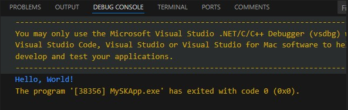
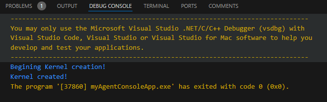
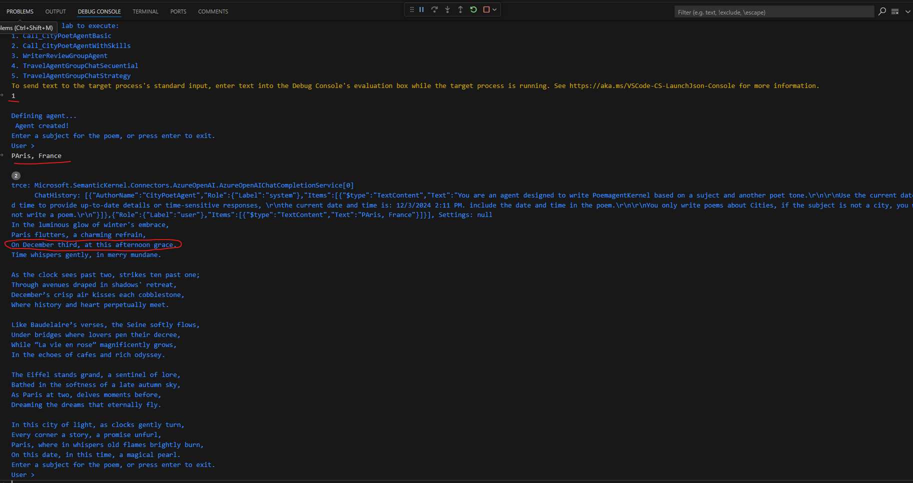
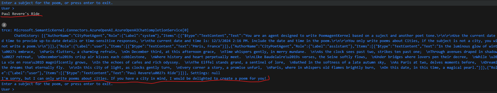

# LAB 6: First Agent, a City Poet  agent based on ChatCompletionAgent
## Introduction
A `Semantic Kernel agent` is an AI-driven entity designed to understand and generate natural language, perform reasoning, and execute actions based on user input and contextual information. These agents leverage semantic understanding to process complex queries and deliver meaningful responses.

In this lab you going to build your first `Semantic Kernel Agent`. This agent going to be avaiable to write Poems about a city based on a user request.


## Learning Objectives

1. Create a first agent with Semantic Kernel
2. Provide `Agent instructions` to define how the agent work
3. How to pass specific data to and Agent using `Kernel Variables`
3. Test the first agent and review Semantic Kernel logging information

## Basic setup
To start the lab, you need to create a .NET Console App and add the necessary NuGet packages for Semantic Kernel and secret management. After that, set the secrets needed to connect the Semantic Kernel with the AI services.

1. TASK: Create a .NET console app Hello World

    All tasks in this lab will be executed in a console app. The first step is to create a console app and add all the necessary references for the Agents.

    ```powershell
    dotnet new console -n myAgentConsoleApp
    ```
    
    Before move forward, test the app by running it.

    

2. TASK: Installing the SDK 
    Semantic Kernel has several NuGet packages available. 
    
    You can install it using the following command in your console app directory:

    ```powershell
    cd .\myAgentConsoleApp\
    dotnet add package Microsoft.SemanticKernel
    dotnet add package Microsoft.Extensions.Logging
    dotnet add package Microsoft.Extensions.Logging.Console
    dotnet add package Azure.Identity
    dotnet add package Microsoft.Extensions.Configuration
    dotnet add package Microsoft.Extensions.Configuration.Binder
    dotnet add package Microsoft.Extensions.Configuration.UserSecrets
    dotnet add package Microsoft.Extensions.Configuration.EnvironmentVariables
    dotnet add package Microsoft.SemanticKernel.Connectors.AzureOpenAI
    dotnet add package Microsoft.SemanticKernel.Agents.Core --prerelease
    ```

    In Visual Studio Code (VS Code), the `Agent Framework` being experimental means it may produce certain compiler warnings. To suppress these warnings, you can configure your project file (.csproj) to ignore specific warning codes. This is done using the `<NoWarn>` element within the project file.

    The Agent Framework is experimental and requires warning suppression, to solve it add `<NoWarn>` items in the project file (.csproj):

    ```XML
    <PropertyGroup>
        <NoWarn>$(NoWarn);CA2007;IDE1006;SKEXP0001;SKEXP0110;OPENAI001</NoWarn>
    </PropertyGroup>
    ```

3. Task: Set Secret Management on dev enviroment


    To securely store and read secrets in your .NET application, you can use the `Microsoft.Extensions.Configuration` package along with a secrets management tool like Azure Key Vault or the .NET Secret Manager for local development.

    In this lab, we'll use the .NET Secret Manager (**for local development**)
    
    3.1 Install the necessary NuGet packages:

    ```powershell
    dotnet add package Microsoft.Extensions.Configuration
    dotnet add package Microsoft.Extensions.Configuration.Json
    dotnet add package Microsoft.Extensions.Configuration.UserSecrets 
    ```

    3.2 Initialize user secrets in your project:
        The `dotnet user-secrets init` command initializes the user secrets for your .NET project. When you run this command, it adds a `UserSecretsId` element to your project file (typically the `.csproj` file). This element contains a unique identifier (GUID) that is used to store and manage secrets specific to your project.

    ```powershell
    dotnet user-secrets init
    ```

    3.3  Set secrets using the .NET CLI:
    ```powershell
    dotnet user-secrets set "OpenAI:ModelId" "your_model_id"
    dotnet user-secrets set "OpenAI:Endpoint" "your_endpoint"
    dotnet user-secrets set "OpenAI:ApiKey" "your_api_key"
    ```
 
## Basic Semantic Kernel code and Kernel creation
4. Task:Replace Program.cs code to create your first SK Kernel
    
    To create an agent with SK, the first thing we need is an SK `Kernel`. We will first create the SK and connect it with an Azure OpenAI model. Then, we will set up logging services to gather instrumentation that will help us understand the agent's behaviors.

    The `Services.AddLogging` command in Semantic Kernel is used to add logging services to your application. This is particularly useful for debugging and monitoring the behavior of your AI agents. When you use this command, you can configure various logging providers and set the minimum log level.
    ```csharp
    using Microsoft.Extensions.DependencyInjection;
    using Microsoft.Extensions.Logging;
    using Microsoft.SemanticKernel;
    using Microsoft.SemanticKernel.ChatCompletion;
    using Microsoft.SemanticKernel.Connectors.OpenAI;


    using Microsoft.SemanticKernel.Agents;
    using Microsoft.SemanticKernel.Connectors.AzureOpenAI;

    using Microsoft.Extensions.Configuration;

    namespace AgentsSample;
    class Program
    {

        static Kernel CreateKernel()
        {
            var configuration = new ConfigurationBuilder()
                    .AddUserSecrets<Program>()
                    .Build();

            var modelId = configuration["OpenAI:ModelId"] ?? throw new InvalidOperationException("Model ID not set in secrets.");
            var endpoint = configuration["OpenAI:Endpoint"] ?? throw new InvalidOperationException("Endpoint not set in secrets.");
            var apiKey = configuration["OpenAI:ApiKey"] ?? throw new InvalidOperationException("API Key not set in secrets.");

            var builder = Kernel.CreateBuilder().AddAzureOpenAIChatCompletion(modelId, endpoint, apiKey);
            builder.Services.AddLogging(services => services.AddConsole().SetMinimumLevel(LogLevel.Trace));
            return builder.Build();
        }

        static async Task Main(string[] args)
        {
            //1. Create a Semantic Kernel KERNEL for the agent
            Console.WriteLine("Beginning Kernel creation!");    
            Kernel myKernel =  CreateKernel();
            Console.WriteLine("Kernel created!");
        }
    }
    ```

5. Task: Run and test your enviroment variables before move forward.

    This initial run is to test that all configurations are correct and that the Kernel is working properly. You should see the Kernel messages displayed in the console.
    You should see the Kernel messages in the console.

    

## Agent Creation.

Now that we have the Kernel working, we will create the first agent. To do this, we need to define the agent and code the user interaction to make a request to the agent.

6. Task: Create the first Agent, **City Poet Agent**. This agent has no, tools only an LLM that helps it answer.

    6.1 Create Agent Method.
    
    Choose a meaningful and descriptive name for your agent that reflects its purpose or functionality. For example, **CityPoetAgent** for an agent that write peoms about cities.

    Semantic Kernel **agent instructions** define the behavior and actions of an AI agent. These instructions are similar to prompts used in other AI models but are more flexible and dynamic. Here's a breakdown of what they do:

    * **Define Behavior**: Instructions specify what the agent should do, such as generating text, performing a task, or interacting with other agents. 
    * **Use Templates**: Instructions can include templated parameters, allowing the agent to adapt its responses based on real-time input. For example, an instruction might be "Tell a story about [topic] that is [length] sentences long," where [topic] and [length] are variables.
    * **Dynamic Substitution**: During execution, the agent substitutes the templated parameters with actual values, making the responses context-aware and adaptable.
    * **Modularity**: Instructions can be reused across different agents or scenarios, making it easier to create versatile and maintainable AI systems.

    In Semantic Kernel agents, the notation `{{ variable_name }}` is used to represent placeholders for variables within text templates. These placeholders can be dynamically replaced with actual values when the template is processed. This notation is particularly useful for generating text that needs to adapt based on varying inputs, such as personalized messages, reports, or responses. In this case, the Agento could know the current data and time using `{{$now}}`.

    Add the following method to the Program class.

    ```csharp
    /// <summary>
    /// Create a CityPoetAgent with basic functionality
    /// </summary>
    /// <param name="AgentKernel">Kernel to be used by the agent</param>
    /// <returns></returns>
    static ChatCompletionAgent CreateAgentCityPoetBasic(Kernel AgentKernel)
    {
        //1. Create a CityPoetAgent
        Console.WriteLine("Defining agent...");
        ChatCompletionAgent agent =
            new()
            {
                // 1.1 Name of the agent
                Name = "CityPoetAgent",
                // 1.2 Instructions for the agent, this is the definition of the agent behavior. Should be clear.
                // This instruction is simple, the agent only writes poems about cities.
                // It also includes the current date and time. $now is a placeholder for the current date and time.
                Instructions =
                    """
                    You are an agent designed to write PoemAgentKernel based on a suject and another poet tone.
                    
                    Use the current date and time to provide up-to-date details or time-sensitive responses, 
                    the current date and time is: {{$now}}. Include the date and time in the poem.

                    You only write poems about Cities, if the subject is not a city, you will not write a poem.

                    """,
                // 1.3 Kernel to use for the agent
                Kernel = AgentKernel
            };
        Console.WriteLine(" Agent created!");
        return agent;
    }
    ```

    6.2 Create the Chat loop metod.

    In the chat loop, the agent is created and called using `KernelArguments` that include the `Now` variable. This variable provides the agent with the current date and time, which the agent uses when creating the poem. 

    Semantic Kernel agents can interact in various ways, enhancing their flexibility, adaptability, and effectiveness in different scenarios. Whether it's a simple user query, a multi-agent collaboration, or proactive engagement, these interaction types enable agents to perform a wide range of tasks and provide meaningful, context-aware assistance. 
    
    This implementation is **single-turn interactions**, the agent processes a single user request and provides a response without maintaining a prolonged context.

    In the context of Semantic Kernel agents, **chat history** is essential for maintaining a coherent and contextually relevant conversation. It involves recording all previous interactions between the user and the agent, enabling the agent to understand the context, ensure continuity, and personalize responses. This history helps the agent generate accurate and meaningful replies by referring back to prior messages, thus enhancing the overall user experience by keeping conversations smooth and engaging.

    Add the method **Call_CityPoetAgentBasic** to the Program class.

    ```csharp
    /// <summary>
    /// Call the CityPoetAgent with basic functionality, this method will start a conversation with the agent
    /// </summary>
    /// <param name="AgentKernel"> The agent's kernel</param>
    /// <returns></returns>
    static async Task Call_CityPoetAgentBasic(Kernel AgentKernel)
    {
        //1. Create a CityPoetAgent
        ChatCompletionAgent agent = CreateAgentCityPoetBasic(AgentKernel);

        //2. Create a ChatHistory
        ChatHistory history = [];
        bool isComplete = false;

        //3. Start the conversation loop, to exit the loop, the user must not provide a subject
        do
        {
            //3.1 User inputs
            Console.WriteLine("Enter a subject for the poem, or press enter to exit.");
            Console.Write("User > ");
            string userInput = Console.ReadLine() ?? string.Empty;
            
            if (string.IsNullOrWhiteSpace(userInput))
            {
                //continue;
                isComplete = true;
                break;
            }

            //3.2 Add user input to the history
            history.Add(new ChatMessageContent(AuthorRole.User, userInput));
            Console.WriteLine();
            DateTime now = DateTime.Now;
            
            //3.3 Create arguments to send to the Agent, in this case, we are only sending the current date and time
            KernelArguments arguments =
               new()
                {
                    { "now", $"{now.ToShortDateString()} {now.ToShortTimeString()}" }
                };
            
            //3.4 Invoke the agent
            Console.WriteLine();
            await foreach (var message in agent.InvokeStreamingAsync(history, arguments))
            {   
                Console.Write(message);
            }
            Console.WriteLine();

        } while (!isComplete);
        
    }
    ```
    
    6.3 Task: Update Main method to call the Agent 

    This code provides a menu for the user to select which lab they would like to execute. For this first exercise, the option to use will be 1.

    Add this code to Main method.

    ```csharp
        //1. Create a Semantic Kernel KERNEL for the agent
        Console.WriteLine("Beginning Kernel creation!");    
        Kernel myKernel =  CreateKernel();
        Console.WriteLine("Kernel created!");

        //2. Clone the Kernel for the agent
        Kernel theAgentKernel = myKernel.Clone();

        //3. Select which LAB going to be executed
        Console.WriteLine("Select which lab to execute:");
        Console.WriteLine("1. Call_CityPoetAgentBasic");
        Console.WriteLine("2. Call_CityPoetAgentWithSkills");
        Console.WriteLine("3. WriterReviewGroupAgent");
        Console.WriteLine("4. TravelAgentGroupChatSequential");
        Console.WriteLine("5. TravelAgentGroupChatStrategy");

        var choice = Console.ReadLine();
        switch (choice)
        {
            case "1":
                await Call_CityPoetAgentBasic(myKernel.Clone());
                break;
            case "2":
                //await Call_CityPoetAgentWithSkills(myKernel.Clone());
                new NotImplementedException("This lab is not implemented yet.");
                break;
            case "3":
                //await ProgramChatGroupAgent.WriterReviewGroupAgent(theAgentKernel);
                new NotImplementedException("This lab is not implemented yet.");
                break;
            case "4":
                //await ProgramChatGroupAgent.TravelAgentGroupChatSequential(myKernel.Clone());
                new NotImplementedException("This lab is not implemented yet.");
                break;
            case "5":
                //await ProgramChatGroupAgent.TravelAgentGroupChatStrategy(myKernel.Clone());
                new NotImplementedException("This lab is not implemented yet.");
                break;
            default:
                Console.WriteLine("Invalid choice. Please select a valid lab number.");
                break;
        }
    ```

    6.4 Task: Test the agent. 
    
    Run the console app and  type the city that you would like to use for the poem subject. fo example:
        
        a. Paris, France

        b. New York City 

        c. London, England  

        d. Moscow, Russia  

        e. Delhi, India  

    The agent writes a peom about the city and includes the day and time passed as an argument to the agent. Example outcome:

    
    
    6.5 Task: Test the agent instructions guardrails
    
    The agent only writes poems about the cities, that are defined in the Agent instructions. Try to ask:
        
        Subject:   Paul Revere's Ride
       
    The answer should be reject the request, similar to the following:

    

    6.6 Finish the interaction with the agent sending and empty input and the program will exit.


---
[Back to Lab 6 index.](./README.md)

This is sample code for education propouse, not intented to be used in production.