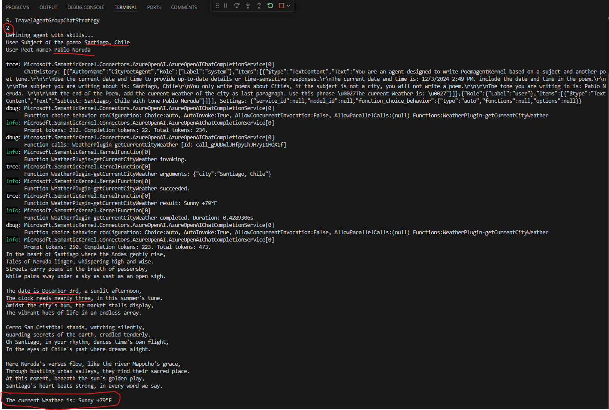

# LAB 6: Second Agent, a City Poet agent based on ChatCompletionAgent with skills
## Introduction

This exercise aims to extend the Agent created in the first exercise by providing it with a skill to search for the current weather of the city where the poem is written and add the city's current weather to it. To achieve this, the agent leverages the Semantic Kernel Plugin as a skill.


## Learning Objectives

1. Create a Semantic Kernel plug-in to be use by the Agent.
2. Use `Agent instructions` to define how the agent work and read specific data  using `Kernel Variables`
3. Create an agent that use skills to execute actions like call and API

## Create Agent Skill (tool)

1. Task: Create a the WeatherPlugin.

    A Semantic Kernel `plugin` is a component that encapsulates standard language functions for applications and AI models to consume. These plugins allow AI models to perform tasks that they wouldn't be able to do otherwise by leveraging existing APIs and services

    The `KernelFunction` attribute is used to mark methods within a plugin class that can be called by an AI agent. When you annotate a method with `KernelFunction`, you're indicating to Semantic Kernel that this method is part of the plugin's functionality and can be invoked by the AI.

    The `Description` attribute is used to provide **semantic descriptions** for the functions within a plugin. These descriptions help the AI agent understand what each function does, what parameters it expects, and what it returns. This is crucial for the AI to correctly call the functions and use them effectively.

    Add a new file call WeatherPlugin.cs in your project, same folder than Program.cs

    Add a new file named `WeatherPlugin.cs` in your project, same folder as Program.cs and add the following code for the plugin.

    ```csharp
    using Microsoft.SemanticKernel;
    using System.ComponentModel;


    namespace AgentsSample
    {
        /// <summary>
        /// WeatherPlugin class
        /// This class provides a method to get the weather of a city
        /// The method is exposed as a kernel function
        /// </summary>
        public class WeatherPlugin 
        {
            [KernelFunction("getCurrentCityWeather")]
            [Description("Provide current City weather using the city name as key search.")]
            public async Task<string> GetWeather(string city)
            {
                var client = new HttpClient();
                var response = await client.GetAsync($"https://wttr.in/{city}?format=%C+%t");
                string theWeather = await response.Content.ReadAsStringAsync();
                return theWeather;
            }
        }
    }
    ```
## Create the Agent

2. Task: Create the new Method  **CreateAgentCityPoetWithSkills**

    In this new Agent version, the agent **receives** 3 parameters (**now**, **subject**, and **poetname**) and also has the skill to check the current weather using the SK Plugin `WeatherPlugin` created below.

    `FunctionChoiceBehavior.Auto()` from Semantic Kernel is a configuration option that allows the AI model to decide whether to call functions and, if so, which ones to call. When you set the function choice behavior to `Auto()`, the model is given the flexibility to choose from zero or more functions provided to it. This means the model can decide if it needs to invoke any function at all, and if it does, it can select the most appropriate one based on the context.

    By using `AgentKernel.Plugins.AddFromObject(weatherPlugin)`, you can easily integrate Weahter infromaation by city into your Semantic Kernel agent, making it more versatile and capable of handling specific tasks.

    Add a the `CreateAgentCityPoetWithSkills` method to the Class `Program`.

    ```csharp
    static ChatCompletionAgent CreateAgentCityPoetWithSkills(Kernel AgentKernel)
    {
        //1. Add a WeatherPlugin to the Kernel, for this agent to use
        // This plugin will provide the weather of the city at the end of the poem.
        WeatherPlugin weatherPlugin = new();
        AgentKernel.Plugins.AddFromObject(weatherPlugin);

        //2. Create a CityPoetAgent
        Console.WriteLine("Defining agent with skills...");
        ChatCompletionAgent agent =
            new()
            {
                // 1.1 Name of the agent
                Name = "CityPoetAgent",
                // 1.2 Instructions for the agent, this is the definition of the agent behavior. Should be clear.
                // This instruction is more detailed than the previous one, it includes the subject and tone of the poem.
                // It also includes the weather of the city at the end of the poem. (This is a skill)
                Instructions =
                    """
                    You are an agent designed to write PoemagentKernel based on a suject and another poet tone.
                    
                    Use the current date and time to provide up-to-date details or time-sensitive responses.
                    The current date and time is: {{$now}}. include the date and time in the poem.

                    The subject you are writing about is: {{$subject}}
                    You only write poems about Cities, if the subject is not a city, you will not write a poem.

                    The tone you are writing in is: {{$poetName}}. 

                    At the end of the Poem, add the current weather of the city as last paragraph. Use this phrase 'The current Weather is: '
                    """,
                // 1.3 Kernel to use for the agent
                Kernel = AgentKernel,
                // 1.4 Arguments to pass to the agent. 
                // This agent will use the FunctionChoiceBehavior.Auto() to select the best function to use.
                Arguments =
                    new KernelArguments(new AzureOpenAIPromptExecutionSettings() 
                    { 
                        FunctionChoiceBehavior = FunctionChoiceBehavior.Auto() 
                    })
                    
            };
        return agent;
    }
    ```


## Creat Chat loop
3. Task: Create a new method **Call_CityPoetAgentWithSkills** 

    3.1 Create the method `Call_CityPoetAgentWithSkills`
    
    This method create a Agent instance and control the chat loop. It capture 2 variables used by the agent: *Subject* and *Poet*.

    `KernelArguments` in Semantic Kernel provides a way to pass dynamic arguments to the kernel's functions or agents. These arguments allow you to customize and control the behavior of the kernel at runtime, making it more flexible and adaptable to different scenarios.

    ```csharp
        /// <summary>
        /// Call the CityPoetAgent with skills, this method will start a conversation with the agent
        /// </summary>
        /// <param name="AgentKernel"></param>
        static async Task Call_CityPoetAgentWithSkills(Kernel AgentKernel)
        {
            //1. Create a CityPoetAgent
            ChatCompletionAgent agent = CreateAgentCityPoetWithSkills(AgentKernel);
            //2. Create a ChatHistory
            ChatHistory history = [];
            bool isComplete = false;
            //3. Start the conversation
            do
            {
                //3.1 User inputs, specific to the agent as structure data to be pass as arguments.
                // The user will provide the subject of the poem and the poet name to apply the tone.
                Console.Write("User Subject of the poem> ");
                string inputSubject = Console.ReadLine() ?? string.Empty;
                Console.Write("User Poet name> ");
                string inputPoet = Console.ReadLine() ?? string.Empty;
                
                //3.1.1 Combine the user inputs in a message for the agent
                string userInput=$"Subject: {inputSubject} with tone {inputPoet}";

                //3.1.2 Check if the user wants to exit the conversation
                if (string.IsNullOrWhiteSpace(inputSubject))
                {
                    //continue;
                    isComplete = true;
                    break;
                }

                //3.2 Add user input to the history
                history.Add(new ChatMessageContent(AuthorRole.User, userInput));
                
                DateTime now = DateTime.Now;

                //3.3 Create arguments to send to the Agent
                // This time we are sending the subject and the poet name to the agent.
                // The agent will use this information to write the poem.
                // This is the technical to pass specific data to the agent.
                KernelArguments arguments =new()
                {
                    { "now", $"{now.ToShortDateString()} {now.ToShortTimeString()}" },
                    { "subject", inputSubject },
                    { "poetName", inputPoet }
                };
                
                Console.WriteLine();

                //3.4 Invoke the agent
                await foreach (ChatMessageContent response in agent.InvokeAsync(history, arguments))
                {
                    // Display response.
                    Console.WriteLine($"{response.Content}");
                }
                Console.WriteLine();


            } while (!isComplete);
            
        }
    ```

    3.2 Update Main method to include the reference to Call_CityPoetAgentWithSkills

     ```csharp
    case "2":
        await Call_CityPoetAgentWithSkills(theAgentKernel);
        break;
     ```
## Test the new agent
4. Task: Run the program and select option 2

    4.1 Enter a subject like Santiago, Chile 
    
    4.2 Enter a Peot name like Pablo Neruda

    Notice the response contains the date and time and also the current weather on the City as it is shows in the following image.


 

The current wheater is provided by the WeatherPlugins, it is an skill that provide the Agent the capacity to execute actions.


---
[Back to Lab 6 index.](./README.md)

This is sample code for education propouse, not intented to be used in production.