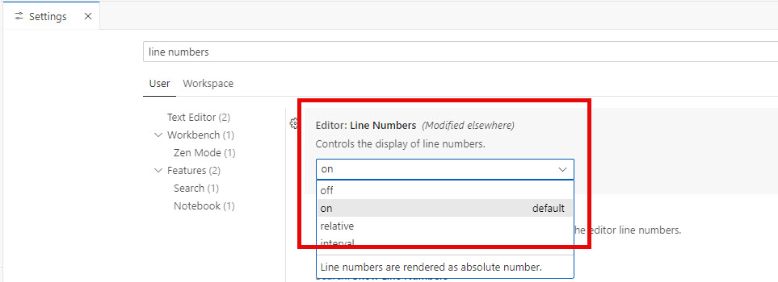
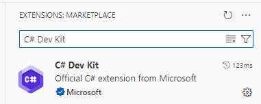
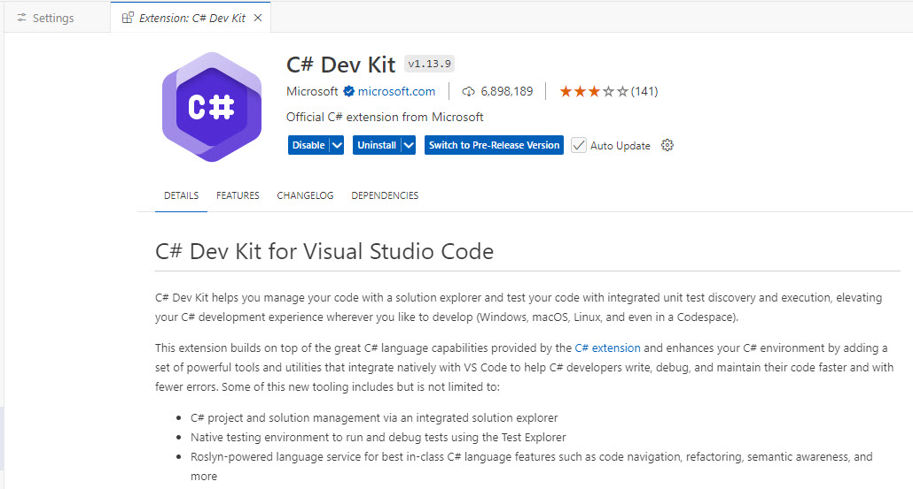

# Setup 

1. Ensure you have all the [prerequisites](https://github.com/bostonazure/rag-vector-agent-semantic-kernel/tree/main?tab=readme-ov-file#prerequisites) installed

2. On your machine, you'll need a directory to put the code in. Open a console window and navigate to where you want to put the code. The run the following command:

```console
git clone https://github.com/bostonazure/rag-vector-agent-semantic-kernel.git
```

## Visual Studio

In order to follow along with the labs you'll want to do the following:

### Enable line numbers
1. Go to Tools -> Options menu item
2. Type line numbers in the search box
3. Ensure the Line numbers checkbox is checked


## Visual Studio Code

In order to follow along with the labs you'll want to do the following:

### Enable line numbers
1. Go to the File -> Settings menu item
2. Type **line numbers** in the search box
3. Verify they are turned on



### Install C# Dev Kit extension

In order to easily follow along wit the labs, we recommend you install the C# Dev Kit extension.

1. Open the extensions panel and type **C# Dev Kit**



2. Select and install

